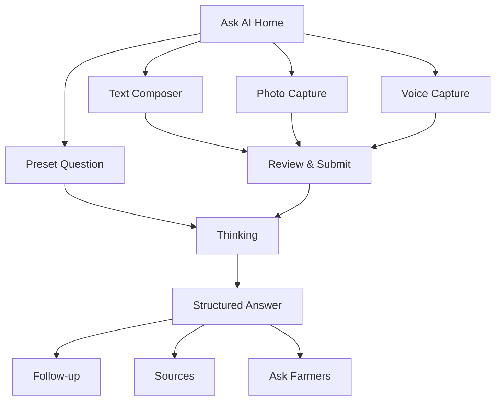

# AgriLink Ask AI — Product & Engineering Specification

> **Product promise:** Turn one question, one photo, or one voice note into a short, local, actionable farming answer on a keypad phone.
>
> **Target:** Cloud Phone widget · 240×320 primary · 128×160 bonus · keypad-only compatible · Gemini-powered · resilient on unstable mobile networks.
>
> **Repository:** `dogbark-MeiChu/dogbark` · **Document status:** implementation-ready · **Priority:** P0

---

## 0. The page must feel impressive in the first five seconds

The current product must not open with a plain list or an empty chat screen. It should open like a polished AI search product: a strong branded hero, one obvious input surface, useful example prompts, and visible support for text, camera, and voice.

The visual language borrows the best interaction patterns from Google AI Mode, Gemini, Perplexity, and modern search copilots:

- One unified composer instead of separate complicated tools.
- Suggested questions so a keypad user can get value without typing.
- Answers are structured into scannable cards, not long chatbot paragraphs.
- Sources and confidence are visible when claims depend on external information.
- Follow-up questions continue the same context.
- Text, image, and voice all enter the same answer pipeline.

This is **not** a generic chatbot. Every answer is grounded in the farmer profile, location, crops, current weather when available, and the attached media.

### First-screen visual target — 240×320

```text
┌────────────────────────┐
│ AGRILINK AI       ● ON │
├────────────────────────┤
│       ◉ AI FIELD       │
│  Ask. Snap. Speak.     │
│  Get a clear next step │
│                        │
│ ┌────────────────────┐ │
│ │ Ask about your farm│ │
│ │ [Type] [Photo] [Mic]││
│ └────────────────────┘ │
│                        │
│ 1  Why are leaves yellow?│
│ 2  Is rain safe for spray?│
│ 3  Sell rice now or wait? │
│ 4  Find local support     │
├────────────────────────┤
│ Options    Ask     Back │
└────────────────────────┘
```

Visual requirements:

- Background: deep agricultural green `#071B0C` with a subtle radial glow behind the AI mark.
- Hero mark: small animated pulse/ring made with CSS only; no heavy image asset.
- Accent: warm sun yellow `#FFD84D`; health/status accent `#62E08A`.
- Composer: rounded 10px dark card, 1px translucent border, strong focused state.
- The top 96px should look intentionally designed even before data loads.
- Avoid gradients with more than two stops, glassmorphism blur, or large images; they cost bandwidth and may render poorly.
- Motion must be subtle and optional: pulse only while waiting, disabled under `prefers-reduced-motion`.

### Compact target — 128×160

```text
┌──────────────┐
│ AGRI AI   ●  │
├──────────────┤
│ Ask/Snap/Talk│
│ > Ask a farm │
│   question   │
│ 1 Yellow leaf│
│ 2 Rain/spray │
│ 3 Rice price │
├──────────────┤
│ Opt Ask Back │
└──────────────┘
```

At 128×160, hide decorative copy, show three presets, collapse media actions into `Options`, and keep the softkey bar permanently visible.

---

## 1. Scope and success criteria

### P0 — must work in the competition demo

1. Beautiful Ask AI landing screen.
2. Four preset questions selectable by number key.
3. Free English multi-tap input using the existing keypad dispatcher.
4. Gemini text answer through the backend only.
5. Structured answer cards: summary, next steps, warning, confidence, sources.
6. Follow-up questions using a server-issued conversation ID.
7. Loading, timeout, offline, rate-limit, and invalid-model-output fallbacks.
8. Full operation at 240×320 and usable operation at 128×160.
9. API key read from server environment; never delivered to the browser.

### P1 — strong demo differentiators

1. Photo attachment through camera/file capture when the platform exposes it.
2. Voice recording through `MediaRecorder` when microphone access exists.
3. Speech transcription followed by the same AI answer pipeline.
4. Hindi output option and language-aware presets.
5. Local recent-question history stored without sensitive media.

### P2 — only after P0/P1 are stable

1. Predictive T9 candidates.
2. Voice playback of the final answer.
3. Live weather/market tools selected by the backend agent.
4. Expert escalation into Farmer Circle.

### Non-goals

- No medical-grade or guaranteed diagnosis.
- No pesticide dosage recommendation without a safety warning and source.
- No real-time video stream.
- No API key in frontend code, query strings, Git history, logs, or screenshots.
- No continuous microphone listening.
- No requirement that camera/microphone must exist on every Cloud Phone runtime.

---

## 2. Information architecture and screen states



Required screen modules:

| Screen | Purpose | Primary action |
|---|---|---|
| `AskAIHome` | Hero, unified composer, presets | Enter opens composer; 1–4 submits preset |
| `AskAIInput` | Multi-tap/T9 editing | `#` or center softkey submits |
| `AskAIMediaMenu` | Choose photo or voice | Up/down + Enter |
| `AskAIPhoto` | Capture/select, preview, remove | Confirm upload |
| `AskAIVoice` | Record, timer, playback/re-record | Send recording |
| `AskAIThinking` | Branded progress and cancel | Right softkey cancels |
| `AskAIAnswer` | Structured, paginated answer | Up/down scroll; Enter expands selected card |
| `AskAISources` | Compact source list | Enter opens source only if safe/supported |
| `AskAIHistory` | Last five text questions | Enter repeats question |

---

## 3. Keypad behavior

All actions must pass through the existing `keypad.js` and router. Do not add screen-specific global `keydown` listeners.

### Home

| Key | Behavior |
|---|---|
| Up / Down | Move focus between composer and preset rows |
| Enter | Open focused item |
| `1`–`4` | Immediately submit matching preset |
| Left softkey | Open Options: Photo, Voice, History, Language |
| Right softkey / platform back | Return to main menu |
| `*` | Open recent history |
| `#` | Open free-text composer |

### Text composer

| Key | Behavior |
|---|---|
| `2`–`9` | Multi-tap characters |
| `1` | `. , ? ! 1` |
| `0` | Space |
| `*` | Delete one character; long press clears all if long-press is available |
| `#` | Commit pending character; second `#` within 700ms submits |
| Left / Right | Move cursor when supported; otherwise cycle T9 suggestion |
| Up / Down | Cycle predictive candidate or preset completion |
| Enter | Submit |
| Right softkey | Cancel and return without submitting |

### Voice capture

| Key | Behavior |
|---|---|
| Enter | Start / stop recording |
| Left softkey | Re-record |
| Center softkey | Send |
| Right softkey | Cancel |

### Answer

| Key | Behavior |
|---|---|
| Up / Down | Scroll between answer cards |
| Left / Right | Previous/next page within long card |
| Enter | Expand/collapse focused card |
| `1` | Ask follow-up |
| `2` | View sources |
| `3` | Ask Farmer Circle |
| `*` | Save answer locally |
| `#` | Start a new question |
| Right softkey | Back |

---

## 4. Preset questions

Preset questions reduce keypad friction and make the demo reliable. The backend receives stable IDs rather than only display text.

```js
const ASK_AI_PRESETS = [
  {
    id: 'yellow_leaves',
    label: 'Why are leaves yellow?',
    text: 'My crop leaves are turning yellow. What should I check first?',
    intent: 'crop_diagnosis'
  },
  {
    id: 'rain_spray',
    label: 'Is rain safe for spray?',
    text: 'Based on local weather, is it safe to spray today?',
    intent: 'weather_action'
  },
  {
    id: 'sell_or_wait',
    label: 'Sell rice now or wait?',
    text: 'Should I sell my rice now or wait? Explain the main trade-off.',
    intent: 'market_decision'
  },
  {
    id: 'local_support',
    label: 'Find local support',
    text: 'What local agriculture support or subsidy should I check?',
    intent: 'government_support'
  }
];
```

The display label may be translated, but the preset ID must remain stable.

---

## 5. Unified composer

The composer is one component with three input modes:

```js
{
  mode: 'text' | 'photo' | 'voice',
  text: '',
  image: null,
  audio: null,
  language: 'en',
  conversationId: null
}
```

Rules:

- Text is optional when a photo or voice clip exists.
- At least one of `text`, `image`, or `audio` is required.
- Maximum text length: 300 characters.
- Maximum one image and one audio clip per request.
- Show attachment state explicitly: `PHOTO READY`, `VOICE 08s`, or `NO ATTACHMENT`.
- Never upload media until the user confirms Send.
- Cancel must abort the active fetch using `AbortController`.

---

## 6. Photo input

### Capability strategy

Use progressive enhancement because Cloud Phone hardware bridging is not guaranteed.

1. Preferred: hidden file input with camera hint:

```html
<input id="ask-photo" type="file" accept="image/jpeg,image/png,image/webp" capture="environment" hidden>
```

2. If file selection/capture is unavailable: show two preloaded demo samples labelled `DEMO SAMPLE`.
3. If the browser exposes `navigator.mediaDevices.getUserMedia`, direct camera preview may be tested later, but it is not required for P1.

### Client processing

- Reject files above 8 MB before decode.
- Decode with `createImageBitmap` when available; fall back to `Image`.
- Resize longest edge to 1024px.
- Convert to JPEG quality `0.72` unless transparency is necessary.
- Strip EXIF by redrawing to canvas.
- Target upload size: under 700 KB.
- Show an 80×80 preview, filename omitted for privacy.

### Photo-analysis behavior

The model must not claim certainty. It should return likely observations, what to inspect next, urgency, and when to seek local expert help.

If the image is blurry, unrelated, or insufficient, return `needs_better_photo: true` with one precise retake instruction such as “Photograph one affected leaf in daylight, front and back.”

---

## 7. Voice input

### Capability strategy

Enable voice only when all are true:

```js
const canRecord = Boolean(
  navigator.mediaDevices?.getUserMedia &&
  window.MediaRecorder
);
```

If unsupported, keep the menu item visible but disabled with `Not available on this device`; offer text input immediately.

### Recording requirements

- Ask for microphone permission only after the user explicitly selects Voice.
- Maximum duration: 30 seconds.
- Stop automatically at 30 seconds.
- Prefer `audio/webm;codecs=opus`; accept browser-selected MIME type.
- Display elapsed seconds and a simple CSS level indicator.
- Allow playback, re-record, or send.
- Release every media track immediately after stop/cancel.
- Do not store raw audio after transcription succeeds.

### Backend processing

Recommended pipeline:

1. Receive multipart audio.
2. Validate MIME type and size (maximum 2.5 MB).
3. Send audio to a Gemini model capable of audio understanding or transcription.
4. Normalize transcript.
5. Run the same structured Ask AI pipeline using transcript as the user question.
6. Return both `transcript` and `answer`; the user can confirm what the system heard.

For demo stability, voice failure must return to the composer with the recording preserved long enough to retry once.

---

## 8. Answer experience

Do not render a long markdown response. Render a fixed sequence of cards from validated JSON.

### Card order

1. **Bottom line** — one sentence, maximum 100 characters.
2. **Do now** — up to three numbered actions.
3. **Why** — up to two evidence/reason bullets.
4. **Watch for** — danger signs or uncertainty.
5. **Local context** — location/crop/weather/market context actually used.
6. **Sources** — zero to three source labels/URLs.
7. **Follow-ups** — two short suggested next questions.

### Example answer screen

```text
┌────────────────────────┐
│ AI ANSWER       MEDIUM │
├────────────────────────┤
│ Bottom line            │
│ Yellowing may come from│
│ excess water or low N. │
│                        │
│ Do now                 │
│ 1 Check soil moisture  │
│ 2 Inspect lower leaves │
│ 3 Avoid extra watering │
│                        │
│ ▼ Why / Watch for      │
├────────────────────────┤
│ Follow-up  More   Back │
└────────────────────────┘
```

### Trust indicators

- `LOW`, `MEDIUM`, or `HIGH` confidence appears in the status line.
- `SAMPLE DATA` appears whenever seed/demo data was used.
- `CACHED` appears when a previous answer was returned due to outage.
- Safety-critical advice always includes a warning card.
- A source must only appear if the backend really used or received it; the model may not invent URLs.

---

## 9. Backend API contract

All endpoints are under `/api/ai`. The frontend never calls Gemini directly.

### `GET /api/ai/capabilities`

Returns server-side availability and feature flags.

```json
{
  "ok": true,
  "provider": "gemini",
  "text": true,
  "image": true,
  "audio": true,
  "maxTextChars": 300,
  "maxImageBytes": 734003,
  "maxAudioSeconds": 30
}
```

Never return the model API key or internal provider error details.

### `POST /api/ai/ask`

Content type: `application/json`

```json
{
  "requestId": "client-generated-uuid",
  "conversationId": null,
  "presetId": "yellow_leaves",
  "text": "My rice leaves are yellow",
  "language": "en",
  "userContext": {
    "region": "IN-BR",
    "crops": ["rice"],
    "experienceLevel": "smallholder"
  }
}
```

### `POST /api/ai/ask-media`

Content type: `multipart/form-data`

Fields:

| Field | Required | Notes |
|---|---:|---|
| `requestId` | yes | Idempotency key |
| `conversationId` | no | Follow-up context |
| `text` | no | Optional accompanying question |
| `language` | yes | `en`, then `hi` P1 |
| `context` | yes | JSON string; validate after parse |
| `image` | conditional | One compressed JPEG/PNG/WebP |
| `audio` | conditional | One recording, ≤30 seconds |

At least one of `text`, `image`, or `audio` must be present.

### Successful response

```json
{
  "ok": true,
  "requestId": "...",
  "conversationId": "conv_01J...",
  "intent": "crop_diagnosis",
  "transcript": null,
  "answer": {
    "headline": "Check water and lower leaves first",
    "summary": "Yellowing may come from excess water or low nitrogen.",
    "actions": [
      { "label": "Check soil", "detail": "If soil stays wet, pause watering." },
      { "label": "Inspect leaves", "detail": "Note whether old or new leaves yellow first." }
    ],
    "reasons": ["Waterlogged roots cannot absorb nutrients well."],
    "warnings": ["Do not add fertilizer until soil condition is checked."],
    "confidence": "medium",
    "needs_better_photo": false,
    "retake_instruction": null,
    "context_used": ["crop: rice", "region: IN-BR"],
    "sources": [],
    "follow_ups": ["Which leaves yellow first?", "Has the field flooded recently?"],
    "disclaimer": "AI guidance is not a substitute for a local agronomist."
  },
  "meta": {
    "cached": false,
    "sampleData": false,
    "latencyMs": 1840
  }
}
```

### Error response

```json
{
  "ok": false,
  "error": {
    "code": "AI_TIMEOUT",
    "message": "AI is taking longer than usual.",
    "retryable": true,
    "fallbackAvailable": true
  }
}
```

Stable error codes:

`INVALID_INPUT`, `MEDIA_UNSUPPORTED`, `MEDIA_TOO_LARGE`, `AI_TIMEOUT`, `AI_RATE_LIMIT`, `AI_INVALID_OUTPUT`, `AI_UNAVAILABLE`, `UNSAFE_REQUEST`, `INTERNAL_ERROR`.

---

## 10. Gemini integration

### Environment contract

```env
AI_PROVIDER=gemini
GEMINI_API_KEY=
GEMINI_MODEL=gemini-2.5-flash-lite
GEMINI_TIMEOUT_MS=12000
AI_MAX_OUTPUT_TOKENS=500
AI_RATE_LIMIT_PER_MINUTE=6
AI_CACHE_TTL_SECONDS=600
```

The team supplies `GEMINI_API_KEY` separately on the Ubuntu server. It must remain absent from the repository.

### Adapter interface

```js
export async function askAI({
  requestId,
  conversationId,
  text,
  image,
  audio,
  language,
  userContext,
  signal
}) {
  // Return validated AskAIResponse only.
}
```

### System instruction

```text
You are AgriLink AI, a practical assistant for smallholder farmers using a
240x320 keypad phone. Give short, actionable, locally relevant guidance.

User context may include region, crops, weather, and market information.
Use only context explicitly provided by the application. Never invent a live
price, current weather value, government program, source URL, or certainty.

For crop images, describe visible observations and likely possibilities. Do not
claim definitive diagnosis. If image quality is insufficient, request one clear
retake. For chemical or pesticide topics, prioritize label instructions, local
regulations, protective equipment, and expert confirmation.

Return only JSON matching the supplied schema. Keep strings short enough for a
small screen. Use the requested language. Do not return markdown or HTML.
```

### Validation

- Validate model output with `ajv` before returning it to the client.
- Strip unknown properties with an explicit schema policy.
- Enforce string lengths after validation.
- Reject model-supplied URLs unless they match a backend-provided source allowlist.
- On invalid output, attempt one repair call; after that use a deterministic fallback.
- Never insert model content with `innerHTML`; render with `textContent`.

---

## 11. Reliability, cost, and privacy

### Latency budget

| Stage | Target |
|---|---:|
| UI reaction after submit | <100ms |
| Show thinking state | immediate |
| Text answer p50 | <3s |
| Text answer hard timeout | 12s |
| Photo/voice answer hard timeout | 20s |

The loading screen cycles through useful states: `Reading question`, `Checking context`, `Preparing steps`. These are UI messages, not fake chain-of-thought.

### Cost controls

- One Gemini call only after explicit submit, never per keypad press.
- Deduplicate with `requestId`.
- Cache normalized preset/context combinations for 10 minutes.
- Limit history sent to the model to the last four turns.
- Truncate all inputs server-side.
- Default output limit: 500 tokens; UI text limits should keep real output much smaller.
- Per-user/IP rate limit: six requests per minute and 30 per day for demo.

### Privacy

- Do not log raw images, audio, transcripts, or full questions in production logs.
- Log request ID, intent, latency, error code, model, and token usage only.
- Delete temporary media in `finally` blocks.
- Do not persist media unless a future feature receives explicit consent.
- Remove image metadata client-side and revalidate server-side.
- State clearly before capture: “Photo/voice is sent to AI for this answer.”

### Offline and outage fallback

Fallback priority:

1. Fresh cached matching answer.
2. Deterministic intent-specific checklist.
3. Link to Farmer Circle with the user’s draft carried over locally.

Never show a blank page or raw provider exception.

---

## 12. Repository implementation map

The current repository is Vanilla JS + Express. Keep that architecture.

### Add

```text
frontend/js/screens/askAIHome.js
frontend/js/screens/askAIInput.js
frontend/js/screens/askAIMedia.js
frontend/js/screens/askAIThinking.js
frontend/js/screens/askAIAnswer.js
frontend/js/t9.js
frontend/js/media.js
frontend/css/ask-ai.css

backend/routes/ai.js
backend/services/aiAdapter.js
backend/services/geminiProvider.js
backend/services/aiSchemas.js
backend/services/aiFallbacks.js
backend/services/mediaService.js
backend/services/aiAdapter.test.js
```

### Modify

| File | Required change |
|---|---|
| `frontend/js/screens/mainMenu.js` | Change Ask AI target from `ComingSoon` to `AskAIHome` |
| `frontend/js/main.js` | Import/register all Ask AI screens |
| `frontend/js/api.js` | Add `postJSON` and `postFormData` with timeout + abort support |
| `frontend/js/router.js` | Allow screen-specific center softkey handler and clean `onHide` cancellation |
| `frontend/index.html` | Add `ask-ai.css` stylesheet |
| `backend/server.js` | Add JSON size limit, `/api/ai` router, multipart error handling |
| `backend/package.json` | Add `@google/genai`, `ajv`, `multer`, `express-rate-limit`, `dotenv` |
| `backend/.env.example` | Add model, timeout, output, rate-limit, cache variables; leave key blank |
| `.gitignore` | Confirm `.env`, temporary media, and upload directories are ignored |

### Suggested dependency additions

```json
{
  "@google/genai": "latest",
  "ajv": "latest",
  "dotenv": "latest",
  "express-rate-limit": "latest",
  "multer": "latest"
}
```

Pin exact versions in `package-lock.json` after installation. Do not depend on a client-side Gemini SDK.

---

## 13. CSS component requirements

Suggested tokens:

```css
:root {
  --ai-bg: #071b0c;
  --ai-surface: #102a16;
  --ai-surface-2: #17381e;
  --ai-text: #f5fbf4;
  --ai-dim: #a8c4ad;
  --ai-accent: #ffd84d;
  --ai-good: #62e08a;
  --ai-warn: #ffb454;
  --ai-danger: #ff6b62;
  --ai-radius: 10px;
}
```

Required components:

- `.ai-hero`
- `.ai-orb`
- `.ai-tagline`
- `.ai-composer`
- `.ai-mode-badge`
- `.ai-preset`
- `.ai-attachment`
- `.ai-progress`
- `.ai-card`
- `.ai-confidence`
- `.ai-warning`
- `.ai-source`
- `.ai-followup`

Focused elements must have both a background/color change and a left-edge marker; do not rely only on color. Body content must never scroll underneath the softkey bar.

---

## 14. Security requirements

- API key exists only in `backend/.env` or server secret storage.
- Enable HTTPS before requesting microphone/camera; browser media APIs require a secure context.
- Validate every input type, length, MIME type, and decoded file signature.
- Never trust client-provided user context as authorization data.
- Escape/render all model text as plain text.
- Apply rate limiting before expensive upload/model processing.
- Use idempotency via `requestId` to prevent duplicate charges on retries.
- Do not accept arbitrary remote image URLs; accept uploaded bytes only.
- Reject SVG and executable/polyglot uploads.
- Add a Content Security Policy compatible with the current app.

---

## 15. Analytics for the pitch

Track aggregate events without storing raw user content:

- `ask_ai_opened`
- `preset_selected`
- `text_submitted`
- `photo_attached`
- `voice_recorded`
- `answer_success`
- `answer_fallback`
- `followup_selected`
- `farmer_circle_escalated`
- latency bucket and input mode

The competition narrative can then say: one AI interface supports three literacy/input levels—tap a preset, speak naturally, or show the crop—without requiring a smartphone.

---

## 16. Demo sequence

1. Open Ask AI. Pause briefly on the polished hero and say: “A farmer does not need to learn prompts.”
2. Press `1`; the preset immediately asks about yellow leaves.
3. Show structured answer cards, confidence, and concrete next steps.
4. Press `#` for a new question and demonstrate the custom multi-tap input.
5. If hardware validation passed, open Options → Photo, capture a leaf, and show image-aware guidance.
6. Open Options → Voice, record a five-second question, show the transcript, then the same answer format.
7. End on `Ask Farmers`, proving AI hands uncertain cases to the human community rather than pretending certainty.

Demo safety:

- Keep one preloaded photo sample and one precomputed answer.
- Keep voice optional until verified on the actual itel device.
- Warm the backend before judging.
- Never depend on an unseen live website or a first-time permission dialog during the scored run.

---

## 17. Definition of Done

### Functional

- [ ] Main menu Ask AI opens `AskAIHome`, not `ComingSoon`.
- [ ] All four preset number shortcuts work.
- [ ] Free text can be entered and submitted using keypad only.
- [ ] Gemini API is called only by the backend.
- [ ] Validated structured answers render without markdown/HTML.
- [ ] Follow-up retains conversation context.
- [ ] Back/cancel aborts outstanding requests and does not corrupt router history.
- [ ] Photo works when capture/file APIs exist; otherwise labelled demo sample works.
- [ ] Voice works when media APIs exist; otherwise a clear disabled state appears.
- [ ] Loading, timeout, offline, invalid output, rate limit, and provider outage states are usable.

### Visual

- [ ] First screen looks deliberate and branded at 240×320.
- [ ] Composer is the most visually prominent interactive element.
- [ ] Focus is unmistakable in every state.
- [ ] No clipped text or hidden softkeys at 240×320.
- [ ] Core flow remains usable at 128×160.
- [ ] Long answers are carded/paginated, never one wall of text.

### Safety and engineering

- [ ] `.env` is ignored; API key never appears in browser/network response or Git.
- [ ] Media size/MIME/signature validation exists.
- [ ] Temporary media is deleted after processing.
- [ ] Rate limit and idempotency are tested.
- [ ] Model output schema validation and deterministic fallback are tested.
- [ ] Logs contain no raw media or full sensitive prompt.

### Device acceptance matrix

| Environment | Text | Keypad | Photo | Voice | Required result |
|---|---:|---:|---:|---:|---|
| Desktop Chromium 240×320 | yes | yes | upload | yes | full pass |
| Cloud Phone simulator 240×320 | yes | yes | detect | detect | P0 pass |
| Cloud Phone simulator 128×160 | yes | yes | optional | optional | compact pass |
| itel NEO R60+ | yes | yes | verify | verify | record actual capability |

---

## 18. Build order

1. Register `AskAIHome`, create polished hero and presets.
2. Implement `postJSON`, text endpoint, Gemini adapter, schema, fallback.
3. Implement structured answer cards and follow-up.
4. Implement multi-tap input and keypad acceptance tests.
5. Implement responsive 128×160 view.
6. Add photo progressive enhancement and sample fallback.
7. Add voice progressive enhancement and transcription.
8. Test on simulator and physical device; update capability flags based on evidence.

The page is ready to demo only after steps 1–5 are stable. Photo and voice are impressive multipliers, but they must not be allowed to weaken the reliable keypad text flow.

---

*AgriLink Ask AI specification · prepared for `dogbark-MeiChu/dogbark` · API credentials supplied separately at deployment time.*
