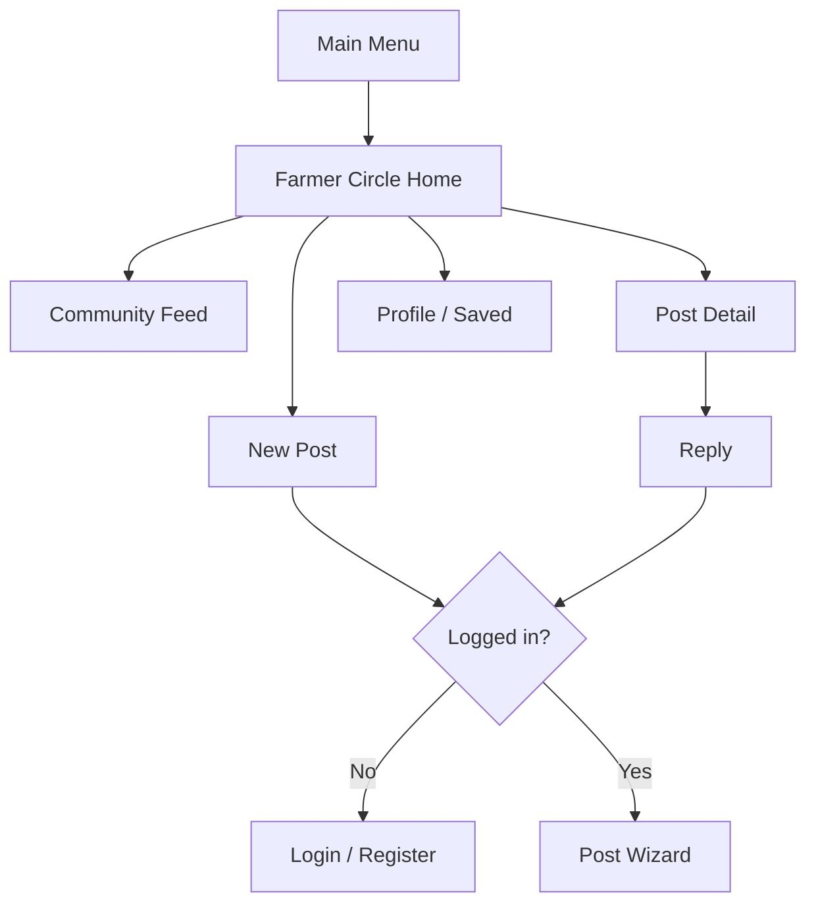

# Farmer Circle — Reddit-style Agricultural Forum

## Copy-paste implementation master prompt

> Build a complete, production-shaped Farmer Circle module inside the existing `dogbark-MeiChu/dogbark` repository. Farmer Circle is a lightweight Reddit-style agricultural forum designed for Cloud Phone feature phones. It must work at 240×320, remain usable at 128×160, and be fully operable with a directional keypad, Enter, softkeys, `0–9`, `*`, and `#`.
>
> **Product rule:** Anyone may browse. A registered and logged-in user is required to create a post, reply, vote, save, report, or mark an answer solved.
>
> **Important:** Farmer Circle contains no AI features. Do not add AI summaries, AI replies, AI moderation, automatic translation, Gemini calls, or LLM dependencies. Its value is real people helping real farmers.

---

## 1. Your role and execution rules

Act as a senior full-stack engineer and product designer. Implement the feature completely rather than creating mock-only screens.

Before editing:

1. Inspect the repository and preserve its existing Vanilla JS + ES modules + Express architecture.
2. Reuse the existing router, focus system, keypad dispatcher, CSS variables, and browser-history behavior.
3. Do not migrate the project to React, Vue, TypeScript, or another framework.
4. Do not break Weather or the existing main menu.
5. Do not expose secrets or create a frontend-only fake authentication system.

During implementation:

- Build real backend persistence with SQLite.
- Build real registration, login, logout, and session authentication.
- Enforce permissions on the server, not only by hiding buttons in the UI.
- Seed realistic forum content so the community looks active immediately.
- Use semantic HTML and plain text rendering; never render user content with `innerHTML`.
- Every asynchronous screen needs loading, empty, error, and retry states.
- Do not leave TODO placeholders in the P0 flow.

After implementation:

- Run all tests.
- Start the server and manually verify the critical flows.
- Report changed files, commands executed, test results, and any physical-device behavior that still requires verification.

---

## 2. Existing repository assumptions

The current repository uses approximately this structure:

```text
backend/
  .env.example
  package.json
  server.js
  routes/
  services/

frontend/
  index.html
  css/
    base.css
    layout.css
    responsive.css
  js/
    api.js
    focus.js
    keypad.js
    main.js
    router.js
    state.js
    screens/
      mainMenu.js
      weather.js
      comingSoon.js
```

Relevant existing behavior:

- `mainMenu.js` currently sends `Farmer Circle` to `ComingSoon`.
- `router.js` maintains browser history and uses a screen stack.
- `focus.js` focuses `.item` elements and scrolls them into view.
- `keypad.js` maps directional keys, Enter, softkeys, digits, `*`, and `#` to normalized actions.
- The right softkey may be handled by platform history rather than reaching the webpage.
- The frontend has no build step.
- Express serves the frontend directory.

Inspect the real repository before applying changes. If actual filenames differ, adapt without duplicating existing infrastructure.

---

## 3. Product definition

Farmer Circle is not Facebook, Dcard, or a general chatroom. It is a compact agricultural discussion forum modeled after the useful parts of Reddit and established farming forums:

- Communities for broad agricultural subjects.
- Threaded posts and replies.
- Voting to surface useful information.
- `Solved` status for questions.
- Location and crop tags.
- Local/New/Top sorting.
- Public reading with authenticated participation.

### One-sentence positioning

> Farmer Circle is a searchable, persistent knowledge community where farmers discuss crops, machinery, markets, livestock, and rural life from a keypad phone.

### Differentiation from existing Cloud Phone social apps

- Facebook follows people; Farmer Circle follows agricultural topics.
- Instagram/TikTok emphasize media consumption; Farmer Circle emphasizes practical threads and answers.
- Marketplace matches buyers and sellers; Market Talk discusses conditions, prices, transport, and experience.
- Ask AI gives machine-generated advice; Farmer Circle gives human experience and community knowledge.

---

## 4. Scope

### P0 — required and fully functional

1. Public forum front page with seeded posts.
2. Five communities.
3. Local, New, and Top sorting.
4. Community filtering and crop/problem tags.
5. Post detail with flat first-level replies.
6. Registration using keypad-friendly fields.
7. Login, logout, persistent secure session, and `GET /api/auth/me`.
8. Auth-required post creation.
9. Auth-required reply creation.
10. Auth-required upvote/downvote with one active vote per user/content item.
11. Auth-required save and report.
12. Author may mark one reply as the accepted solution.
13. User profile, My Posts, Saved Posts, and Logout.
14. SQLite database and deterministic seed script.
15. Complete loading, empty, error, validation, and unauthenticated states.
16. 240×320 and 128×160 layouts.

### P1 — implement after P0 is stable

1. One optional photo per post.
2. Admin/moderator pin, lock, hide, and delete actions.
3. Reply-to-reply displayed as one additional visual indentation level only.
4. Pagination cursor and “Load more”.
5. Notification count for replies to the user’s post.

### Explicit non-goals

- No AI or LLM features.
- No direct messages.
- No live chat.
- No awards.
- No complex karma/reputation economy.
- No payments or marketplace checkout.
- No infinite reply nesting.
- No video uploads.
- No voice transcription.
- No phone-number or email verification unless a real provider is available.
- Never use IMEI as user identity.

---

## 5. Community structure

Create exactly five initial communities. Do not create separate communities for each country, district, or crop; use location and tags instead so the forum does not look empty.

| Slug | Display name | Number key | Purpose | Suggested icon |
|---|---|---:|---|---|
| `crop-talk` | Crop Talk | 1 | Crops, soil, pests, diseases, fertilizer, water | leaf |
| `machinery` | Machinery | 2 | Tools, pumps, tractors, repairs, buying advice | gear |
| `market-talk` | Market Talk | 3 | Prices, selling experience, transport, demand | chart |
| `livestock` | Livestock | 4 | Cattle, goats, poultry, feed, housing | animal |
| `farm-life` | Farm Life | 5 | Rural life, mutual help, policy discussion, general | people |

Location is a filter:

```text
Near Me → same region_code
My Country → same country_code
Everywhere → no location filter
```

Tags are reusable labels. Seed these tags:

```text
rice, maize, wheat, vegetables, fruit,
pest, disease, irrigation, fertilizer, soil,
pump, tractor, repair, buying-advice,
price-report, transport, buyer-demand,
cattle, goat, poultry, feed,
help-needed, policy, farm-life
```

Each post may have zero to two tags. Tags are selected from server-provided choices; do not allow arbitrary tag creation in P0.

---

## 6. Navigation and screen architecture

Add these screens or equivalent modules:

```text
FarmerCircleHome
CommunityList
CommunityFeed
PostDetail
CreatePostType
CreatePostCommunity
CreatePostTitle
CreatePostBody
CreatePostTags
CreatePostLocation
CreatePostPreview
CreateReply
ForumOptions
Login
RegisterProfile
RegisterPin
RegisterComplete
UserProfile
MyPosts
SavedPosts
ReportContent
```

Recommended route flow:



Keep router history correct. Back must return to the previous feed position rather than resetting to the top whenever possible.

---

## 7. Farmer Circle front page

The front page should feel like a compact Reddit feed, not a grid of app icons.

### 240×320 target

```text
┌────────────────────────┐
│ FARMER CIRCLE      ● 3 │
│ Local   New   Top      │
├────────────────────────┤
│ ▲24  Brown spots after │
│      three rainy days  │
│ Crop · Rice · Bihar    │
│ 8 replies · 20m        │
├────────────────────────┤
│ ▲17  Pump makes noise  │
│ Machinery · 5 replies  │
├────────────────────────┤
│ ▲12  Rice ₹34/kg today │
│ Market · Patna · 2h    │
├────────────────────────┤
│ New       Open     Back│
└────────────────────────┘
```

### 128×160 target

```text
┌──────────────┐
│ FARM CIRCLE  │
│ Local New Top│
├──────────────┤
│▲24 Brown spot│
│Crop · 8 reply│
├──────────────┤
│▲17 Pump noise│
│Machine · 5   │
├──────────────┤
│New Open Back │
└──────────────┘
```

### Feed card content

Each row/card displays only:

- Net score.
- Optional state icon: pinned, solved, locked, demo.
- Title, maximum two lines at 240×320 and one line at 128×160.
- Community name.
- Primary tag when present.
- Region label when Local sorting is active.
- Reply count.
- Relative time.

Never place the full body in the feed.

### Feed state

Persist these values when returning from Post Detail:

```js
{
  sort: 'local' | 'new' | 'top',
  community: null | 'crop-talk' | 'machinery' | 'market-talk' | 'livestock' | 'farm-life',
  scope: 'region' | 'country' | 'global',
  tag: null | 'rice' | 'pest' | 'repair' | '...',
  cursor: null,
  focusedPostId: null,
  scrollOffset: 0
}
```

---

## 8. Keypad interaction

All keyboard behavior must go through the shared keypad dispatcher. Do not attach unmanaged global keydown handlers inside every screen.

### Feed

| Input | Action |
|---|---|
| Up / Down | Move between post cards |
| Left / Right | Switch `Local → New → Top` |
| Enter | Open focused post |
| `1`–`5` | Open corresponding community |
| `0` | Clear community filter / All Communities |
| `#` | Open filter/options menu |
| `*` | Open Saved Posts; require login |
| Left softkey | New Post; redirect to Login if guest |
| Right softkey / back | Previous screen |

### Post detail

| Input | Action |
|---|---|
| Up / Down | Move between body/actions/replies |
| Enter | Open focused action or expand focused reply |
| `1` | Upvote post or focused reply; require login |
| `0` | Downvote post or focused reply; require login |
| `2` | Reply; require login |
| `3` | Save/unsave; require login |
| `#` | More: report, mark solved, moderator actions |
| `*` | Jump between original post and replies |
| Left softkey | Context-sensitive `Vote` or `Reply` |
| Right softkey | Back |

### Authentication screens

| Input | Action |
|---|---|
| Digits | Farm ID / PIN entry |
| `*` | Delete |
| `#` | Next/confirm |
| Enter | Next/confirm |
| Right softkey | Cancel |

### Create-post wizard

- Up/down selects choices.
- Digits select numbered choices directly.
- Existing multi-tap input handles title/body.
- `*` deletes within text fields.
- `#` commits or moves to Preview only when valid.
- Right softkey goes to the previous step without discarding completed fields.
- Preview requires explicit confirmation before upload.

---

## 9. Authentication UX

Browsing does not require authentication.

Authentication is required for:

- Create post.
- Reply.
- Vote.
- Save.
- Report.
- Mark solved.
- View personalized My Posts/Saved Posts.

When a guest invokes one of these actions, show a clear gate:

```text
┌────────────────────────┐
│ SIGN IN REQUIRED       │
├────────────────────────┤
│ You can read freely.   │
│ Sign in to post, reply,│
│ vote or save.          │
│                        │
│ 1  Sign in             │
│ 2  Create account      │
│ 3  Continue reading    │
├────────────────────────┤
│ Select            Back │
└────────────────────────┘
```

After successful authentication, return to the action the user originally attempted. Examples:

- Guest presses New Post → login/register → returns to New Post wizard.
- Guest presses Reply → login/register → returns to reply composer for the same post.
- Guest presses Upvote → login/register → returns to same post; do not automatically cast the vote without confirmation.

---

## 10. Registration design

The registration flow must be feasible on a keypad phone.

### Demo authentication model

Use a generated numeric `Farm ID` plus a user-chosen six-digit PIN:

- The server generates a unique eight-digit Farm ID at registration.
- User logs in with Farm ID + six-digit PIN.
- The Farm ID is shown prominently after registration and stored locally only for convenience.
- The PIN is never stored or logged in plain text.
- Do not use IMEI.

This is a competition/demo identity model. Keep the backend service boundary replaceable so a production version can later use carrier identity or SMS OTP.

### Registration steps

1. Choose country.
2. Choose region from a short seeded list.
3. Enter display name, maximum 24 characters, using multi-tap.
4. Select primary crop from a numbered list.
5. Create six-digit PIN.
6. Re-enter PIN.
7. Accept community rules.
8. Server creates account and returns Farm ID.

### Registration completion

```text
┌────────────────────────┐
│ ACCOUNT CREATED        │
├────────────────────────┤
│ Your Farm ID           │
│                        │
│      4827 1593         │
│                        │
│ Save this number.      │
│ Use it with your PIN.  │
├────────────────────────┤
│ Done              Back │
└────────────────────────┘
```

Do not display the PIN after submission.

### Community rules

Show concise rules before account creation:

```text
1 Be respectful.
2 Share honest experience.
3 No scams or payment requests.
4 No dangerous chemical advice.
5 Report harmful content.
```

User must explicitly choose `Accept`.

---

## 11. Login and session security

### Login

Input:

- Eight-digit Farm ID.
- Six-digit PIN.

Rules:

- Farm ID input may contain spaces visually but normalize to digits.
- Do not reveal whether Farm ID or PIN was wrong; return `Invalid Farm ID or PIN`.
- Lock login attempts temporarily after repeated failures.
- Never put credentials in URLs.

### PIN storage

- Hash PIN using `bcryptjs` with cost 12 or a similarly safe password-hashing implementation already present in the repo.
- Six-digit PIN has limited entropy, so server-side rate limiting and lockout are mandatory.
- Never log PIN, PIN hash, session token, or authentication cookie.

### Session design

Use opaque random session tokens:

- Generate with `crypto.randomBytes(32)`.
- Store only SHA-256 token hash in the database.
- Send raw token only in an HttpOnly cookie.
- Cookie properties in production: `HttpOnly`, `Secure`, `SameSite=Lax`, `Path=/`, seven-day expiry.
- Allow `Secure=false` only in explicit local development mode.
- Rotate session after login.
- Logout revokes session server-side and clears cookie.
- Remove expired sessions periodically or on access.

Do not use localStorage as the source of authentication truth.

---

## 12. Create-post flow

### Step 1 — type

```text
1 Question
2 Discussion
3 Local Report
```

Behavior:

- `Question` may later be marked Solved.
- `Discussion` has no accepted answer.
- `Local Report` is a firsthand report; display `USER REPORT`, never `OFFICIAL`.

### Step 2 — community

Select one of the five communities.

### Step 3 — title

- Required.
- 8–80 characters.
- Collapse repeated whitespace.
- Reject control characters.
- Display remaining character count.

### Step 4 — body

- Required.
- 10–500 characters.
- Plain text only.
- Preserve paragraph breaks, maximum four paragraphs.

### Step 5 — tags

- Zero to two tags.
- Only tags allowed for the chosen community should be displayed first.

### Step 6 — location

- Default to the registered user’s region.
- User may choose region-level or country-level display.
- Do not display precise GPS coordinates or home address.

### Step 7 — optional photo, P1

- At most one JPEG/PNG/WebP.
- Resize longest edge to 1024px.
- Strip metadata.
- Target under 700 KB.
- If capture/file upload is unavailable on the device, hide or disable the option without breaking posting.

### Step 8 — preview

Show title, community, tags, location scope, body preview, and photo state. Require explicit `Post` confirmation.

Use a client-generated idempotency key so network retries do not create duplicate posts.

---

## 13. Post detail and replies

### Original post

Display:

- Community.
- Type: Question, Discussion, or User Report.
- Title.
- Body.
- Optional photo.
- Tags.
- Author display name.
- Author region.
- Relative timestamp.
- Score and current user vote.
- Reply count.
- Status: Open, Solved, Locked, or Hidden.

### Replies

P0 replies are flat and sorted by:

1. Accepted solution first.
2. Highest score.
3. Oldest first when scores tie.

Each reply displays:

- Accepted marker when applicable.
- Author display name.
- Body, maximum 400 characters.
- Score.
- Relative time.
- Edited marker when edited.

### Solved behavior

- Only the post author or moderator may mark/unmark a reply as accepted.
- Only Question posts may be Solved.
- Only one accepted reply per post.
- Accepted reply appears first with `✓ SOLUTION`.
- Database update must be transactional.

### Locked behavior

- Everyone may read a locked post.
- No new replies or votes are allowed.
- Existing content remains visible.

---

## 14. Voting

Support values `+1`, `-1`, and no vote.

Rules:

- Authentication required.
- One active vote per user per post.
- One active vote per user per reply.
- Pressing the same vote again removes it.
- Switching direction updates the vote atomically.
- Score equals sum of vote values and must never be accepted directly from the client.
- A user may not vote on hidden content.
- Decide whether self-voting is allowed; preferred behavior is no self-voting.

User-facing feedback must be immediate but reconciled with the server response. If optimistic update fails, restore the old score and show a compact error.

---

## 15. Sorting and filtering

### Local

Default front page sort:

- Same region first.
- Then same country.
- Within each group: pinned first, then newest activity.

### New

- Pinned first within selected community.
- Then `created_at DESC`.

### Top

- Pinned first.
- Highest score from the previous seven days.
- Then reply count.
- Then most recent activity.

### Filters

- Community.
- Tag.
- Region/country/global scope.
- Post type.
- Solved/Open for Question posts.

At 128×160, filters live entirely in the Options screen; do not try to render filter chips in the feed.

---

## 16. Database schema

Use SQLite with foreign keys enabled, WAL mode, parameterized queries, and migrations or idempotent schema initialization.

Suggested schema:

```sql
PRAGMA foreign_keys = ON;
PRAGMA journal_mode = WAL;

CREATE TABLE users (
  id TEXT PRIMARY KEY,
  farm_id TEXT NOT NULL UNIQUE,
  display_name TEXT NOT NULL,
  pin_hash TEXT NOT NULL,
  country_code TEXT NOT NULL,
  region_code TEXT NOT NULL,
  primary_crop TEXT,
  role TEXT NOT NULL DEFAULT 'member'
    CHECK (role IN ('member', 'moderator', 'admin')),
  status TEXT NOT NULL DEFAULT 'active'
    CHECK (status IN ('active', 'suspended', 'deleted')),
  failed_login_count INTEGER NOT NULL DEFAULT 0,
  locked_until TEXT,
  created_at TEXT NOT NULL,
  updated_at TEXT NOT NULL
);

CREATE TABLE sessions (
  id TEXT PRIMARY KEY,
  user_id TEXT NOT NULL REFERENCES users(id) ON DELETE CASCADE,
  token_hash TEXT NOT NULL UNIQUE,
  expires_at TEXT NOT NULL,
  created_at TEXT NOT NULL,
  last_seen_at TEXT NOT NULL,
  revoked_at TEXT
);

CREATE TABLE communities (
  id TEXT PRIMARY KEY,
  slug TEXT NOT NULL UNIQUE,
  name TEXT NOT NULL,
  description TEXT NOT NULL,
  sort_order INTEGER NOT NULL,
  is_active INTEGER NOT NULL DEFAULT 1
);

CREATE TABLE tags (
  id TEXT PRIMARY KEY,
  slug TEXT NOT NULL UNIQUE,
  label TEXT NOT NULL,
  community_id TEXT REFERENCES communities(id) ON DELETE SET NULL,
  is_active INTEGER NOT NULL DEFAULT 1
);

CREATE TABLE posts (
  id TEXT PRIMARY KEY,
  author_id TEXT NOT NULL REFERENCES users(id),
  community_id TEXT NOT NULL REFERENCES communities(id),
  type TEXT NOT NULL CHECK (type IN ('question', 'discussion', 'local_report')),
  title TEXT NOT NULL,
  body TEXT NOT NULL,
  country_code TEXT NOT NULL,
  region_code TEXT NOT NULL,
  location_scope TEXT NOT NULL DEFAULT 'region'
    CHECK (location_scope IN ('region', 'country')),
  image_path TEXT,
  accepted_reply_id TEXT,
  is_pinned INTEGER NOT NULL DEFAULT 0,
  is_locked INTEGER NOT NULL DEFAULT 0,
  is_hidden INTEGER NOT NULL DEFAULT 0,
  is_demo INTEGER NOT NULL DEFAULT 0,
  created_at TEXT NOT NULL,
  updated_at TEXT NOT NULL,
  last_activity_at TEXT NOT NULL
);

CREATE TABLE post_tags (
  post_id TEXT NOT NULL REFERENCES posts(id) ON DELETE CASCADE,
  tag_id TEXT NOT NULL REFERENCES tags(id) ON DELETE CASCADE,
  PRIMARY KEY (post_id, tag_id)
);

CREATE TABLE replies (
  id TEXT PRIMARY KEY,
  post_id TEXT NOT NULL REFERENCES posts(id) ON DELETE CASCADE,
  author_id TEXT NOT NULL REFERENCES users(id),
  parent_reply_id TEXT REFERENCES replies(id) ON DELETE CASCADE,
  body TEXT NOT NULL,
  is_hidden INTEGER NOT NULL DEFAULT 0,
  is_demo INTEGER NOT NULL DEFAULT 0,
  created_at TEXT NOT NULL,
  updated_at TEXT NOT NULL
);

CREATE TABLE votes (
  user_id TEXT NOT NULL REFERENCES users(id) ON DELETE CASCADE,
  target_type TEXT NOT NULL CHECK (target_type IN ('post', 'reply')),
  target_id TEXT NOT NULL,
  value INTEGER NOT NULL CHECK (value IN (-1, 1)),
  created_at TEXT NOT NULL,
  updated_at TEXT NOT NULL,
  PRIMARY KEY (user_id, target_type, target_id)
);

CREATE TABLE saved_posts (
  user_id TEXT NOT NULL REFERENCES users(id) ON DELETE CASCADE,
  post_id TEXT NOT NULL REFERENCES posts(id) ON DELETE CASCADE,
  created_at TEXT NOT NULL,
  PRIMARY KEY (user_id, post_id)
);

CREATE TABLE reports (
  id TEXT PRIMARY KEY,
  reporter_id TEXT NOT NULL REFERENCES users(id),
  target_type TEXT NOT NULL CHECK (target_type IN ('post', 'reply', 'user')),
  target_id TEXT NOT NULL,
  reason TEXT NOT NULL CHECK (reason IN (
    'spam', 'scam', 'harassment', 'dangerous_advice', 'false_information', 'other'
  )),
  note TEXT,
  status TEXT NOT NULL DEFAULT 'open'
    CHECK (status IN ('open', 'reviewed', 'dismissed', 'actioned')),
  created_at TEXT NOT NULL
);

CREATE INDEX idx_posts_community_activity
  ON posts (community_id, last_activity_at DESC);
CREATE INDEX idx_posts_region_activity
  ON posts (region_code, last_activity_at DESC);
CREATE INDEX idx_replies_post
  ON replies (post_id, created_at);
CREATE INDEX idx_sessions_token
  ON sessions (token_hash);
```

SQLite cannot add the circular `posts.accepted_reply_id → replies.id` reference cleanly in this basic definition. Enforce accepted-reply ownership and existence transactionally in service code, or use a migration strategy that supports the reference safely.

---

## 17. API contract

All responses use JSON except optional image upload. Return stable error codes and never leak SQL errors or stack traces.

### Authentication

#### `POST /api/auth/register`

```json
{
  "displayName": "Ravi K.",
  "countryCode": "IN",
  "regionCode": "IN-BR",
  "primaryCrop": "rice",
  "pin": "483921",
  "pinConfirm": "483921",
  "acceptedRules": true
}
```

Response:

```json
{
  "ok": true,
  "user": {
    "farmId": "48271593",
    "displayName": "Ravi K.",
    "countryCode": "IN",
    "regionCode": "IN-BR",
    "primaryCrop": "rice",
    "role": "member"
  }
}
```

Registration should also establish a session unless there is a security reason not to.

#### `POST /api/auth/login`

```json
{ "farmId": "48271593", "pin": "483921" }
```

#### `POST /api/auth/logout`

Revokes current session and clears cookie.

#### `GET /api/auth/me`

Guest response:

```json
{ "ok": true, "authenticated": false, "user": null }
```

Authenticated response:

```json
{
  "ok": true,
  "authenticated": true,
  "user": {
    "farmId": "48271593",
    "displayName": "Ravi K.",
    "countryCode": "IN",
    "regionCode": "IN-BR",
    "primaryCrop": "rice",
    "role": "member"
  }
}
```

### Metadata

#### `GET /api/forum/communities`

Returns active communities with post counts.

#### `GET /api/forum/tags?community=crop-talk`

Returns allowed tags.

### Feed

#### `GET /api/forum/posts`

Query parameters:

```text
sort=local|new|top
community=<slug>
tag=<slug>
scope=region|country|global
type=question|discussion|local_report
status=open|solved
cursor=<opaque>
limit=10
```

Response:

```json
{
  "ok": true,
  "items": [
    {
      "id": "post_001",
      "type": "question",
      "title": "Brown spots after three rainy days",
      "community": { "slug": "crop-talk", "name": "Crop Talk" },
      "tags": ["rice", "disease"],
      "author": { "displayName": "Ravi K.", "regionCode": "IN-BR" },
      "score": 24,
      "replyCount": 8,
      "isSolved": true,
      "isPinned": false,
      "isLocked": false,
      "isDemo": true,
      "createdAt": "2026-09-19T07:40:00Z",
      "lastActivityAt": "2026-09-19T09:20:00Z"
    }
  ],
  "nextCursor": null
}
```

Cursor must be opaque. Do not use page numbers if the feed is activity-sorted.

### Post detail

#### `GET /api/forum/posts/:id`

Returns post, user interaction state, replies, accepted solution, and permission booleans.

```json
{
  "ok": true,
  "post": {},
  "replies": [],
  "viewer": {
    "authenticated": false,
    "vote": 0,
    "saved": false,
    "canReply": false,
    "canModerate": false,
    "canMarkSolved": false
  }
}
```

### Create post

#### `POST /api/forum/posts`

Authentication required.

```json
{
  "requestId": "uuid",
  "type": "question",
  "community": "crop-talk",
  "title": "Brown spots appeared after rain",
  "body": "The spots appeared on older rice leaves after three days of rain.",
  "tags": ["rice", "disease"],
  "locationScope": "region"
}
```

Return `201` and created post. Repeated request ID from the same user must return the original result rather than creating a duplicate.

### Reply

#### `POST /api/forum/posts/:id/replies`

Authentication required.

```json
{
  "requestId": "uuid",
  "body": "Check the underside of the leaf for small insects.",
  "parentReplyId": null
}
```

### Vote

#### `PUT /api/forum/votes`

Authentication required.

```json
{
  "targetType": "post",
  "targetId": "post_001",
  "value": 1
}
```

Sending the active value again removes the vote. Alternatively expose `DELETE`; whichever design is chosen must be documented and tested.

### Save

#### `PUT /api/forum/posts/:id/save`

Authentication required. Idempotently saves.

#### `DELETE /api/forum/posts/:id/save`

Authentication required. Idempotently removes.

### Report

#### `POST /api/forum/reports`

Authentication required.

```json
{
  "targetType": "post",
  "targetId": "post_001",
  "reason": "dangerous_advice",
  "note": "The dosage appears unsafe."
}
```

### Solved

#### `PUT /api/forum/posts/:postId/solution`

```json
{ "replyId": "reply_003" }
```

Authentication required; author/moderator only.

#### `DELETE /api/forum/posts/:postId/solution`

Removes accepted reply; author/moderator only.

### User collections

#### `GET /api/forum/me/posts`

Authentication required.

#### `GET /api/forum/me/saved`

Authentication required.

---

## 18. Error model

Use this envelope:

```json
{
  "ok": false,
  "error": {
    "code": "AUTH_REQUIRED",
    "message": "Sign in to reply.",
    "field": null,
    "retryable": false
  }
}
```

Stable codes:

```text
VALIDATION_ERROR
AUTH_REQUIRED
INVALID_CREDENTIALS
ACCOUNT_LOCKED
ACCOUNT_SUSPENDED
FORBIDDEN
NOT_FOUND
POST_LOCKED
ALREADY_REPORTED
RATE_LIMITED
DUPLICATE_REQUEST
UPLOAD_TOO_LARGE
UNSUPPORTED_MEDIA
INTERNAL_ERROR
```

The UI should interpret codes, not parse English error strings.

---

## 19. Seed content

Create deterministic seeds. Running the seed command more than once must not duplicate data. All fictional posts must set `is_demo = 1` and display a subtle `DEMO` label if necessary.

Use relative seed dates generated from a stable base time or recreate seeds so they appear recent during demo. Do not present fictional local prices as verified official data; titles should make clear they are individual user reports.

### Seed users

Create these fictional members:

| Farm ID | Display name | Region | Crop | Role |
|---|---|---|---|---|
| `10000001` | Ravi K. | IN-BR | rice | member |
| `10000002` | Asha P. | IN-UP | wheat | member |
| `10000003` | Minh Tran | VN-AG | rice | member |
| `10000004` | Rahim U. | BD-RAJ | vegetables | member |
| `10000005` | Meena S. | IN-BR | vegetables | moderator |

Use a documented demo-only PIN such as `246810`, loaded from a seed-specific environment variable where practical. Make sure production seeding cannot silently create public default-password admin accounts.

### Seed posts

#### Post 1 — Crop Talk / Question / Solved

```json
{
  "id": "seed_post_crop_01",
  "author": "10000001",
  "community": "crop-talk",
  "type": "question",
  "title": "Brown spots appeared after three rainy days",
  "body": "Small brown spots appeared on older rice leaves after three days of rain. The lower field stayed wet. Has anyone seen this before?",
  "tags": ["rice", "disease"],
  "region": "IN-BR",
  "score": 24,
  "solved": true
}
```

Replies:

- Meena S.: `Check whether the spots have a grey center. Also inspect the underside before applying anything.` — score 8, accepted.
- Asha P.: `I had similar marks after water stayed in the field. Drain excess water and monitor new leaves.` — score 5.
- Rahim U.: `Post a clear close photo if the spots spread.` — score 2.

#### Post 2 — Machinery / Question

```json
{
  "id": "seed_post_machine_01",
  "author": "10000002",
  "community": "machinery",
  "type": "question",
  "title": "Water pump started making a rattling noise",
  "body": "The pump still moves water but began rattling this morning. The inlet pipe looks clear. What should I inspect before running it again?",
  "tags": ["pump", "repair"],
  "region": "IN-UP",
  "score": 17,
  "solved": false
}
```

Replies:

- Ravi K.: `Stop it first. Check for loose mounting bolts and debris near the impeller.` — score 6.
- Meena S.: `Do not run it dry. Check whether air is entering the suction line.` — score 4.

#### Post 3 — Market Talk / Local Report

```json
{
  "id": "seed_post_market_01",
  "author": "10000001",
  "community": "market-talk",
  "type": "local_report",
  "title": "Rice offered at ₹34/kg in Patna this morning",
  "body": "One buyer offered ₹34/kg for clean, bagged rice this morning. This is my personal report, not an official market quote. What offers are others seeing?",
  "tags": ["rice", "price-report"],
  "region": "IN-BR",
  "score": 12
}
```

Replies:

- Meena S.: `A buyer near my area offered ₹33/kg, but transport was included.` — score 4.
- Ravi K.: `Please include moisture requirements when comparing offers.` — score 3.

#### Post 4 — Livestock / Question

```json
{
  "id": "seed_post_livestock_01",
  "author": "10000004",
  "community": "livestock",
  "type": "question",
  "title": "Goat stopped eating since this morning",
  "body": "One goat is quiet and has not eaten since morning. Clean water is available and the other goats look normal. What signs should I check before calling the vet?",
  "tags": ["goat", "feed"],
  "region": "BD-RAJ",
  "score": 9
}
```

Replies:

- Minh Tran: `Check temperature, stool, breathing, and whether the abdomen looks swollen. Call a vet urgently if breathing is difficult.` — score 5.

#### Post 5 — Farm Life / Discussion

```json
{
  "id": "seed_post_life_01",
  "author": "10000003",
  "community": "farm-life",
  "type": "discussion",
  "title": "Looking to share transport to the district market",
  "body": "I expect about 25 bags next Friday. Is anyone nearby interested in sharing one truck to reduce the transport cost?",
  "tags": ["transport", "help-needed"],
  "region": "VN-AG",
  "score": 8
}
```

Replies:

- Rahim U.: `Add your preferred departure time and approximate distance.` — score 2.

#### Post 6 — Crop Talk / Discussion

```json
{
  "id": "seed_post_crop_02",
  "author": "10000003",
  "community": "crop-talk",
  "type": "discussion",
  "title": "How long do you wait after heavy rain before fertilizing?",
  "body": "The field is still soft after yesterday's rain. I usually wait until standing water clears. What do other rice growers do?",
  "tags": ["rice", "fertilizer"],
  "region": "VN-AG",
  "score": 15
}
```

#### Post 7 — Machinery / Discussion

```json
{
  "id": "seed_post_machine_02",
  "author": "10000004",
  "community": "machinery",
  "type": "discussion",
  "title": "What should I check when buying a used irrigation pump?",
  "body": "I am comparing two used pumps. Besides leaks and startup noise, what checks have saved you from a bad purchase?",
  "tags": ["pump", "buying-advice"],
  "region": "BD-RAJ",
  "score": 13
}
```

#### Post 8 — Market Talk / Discussion

```json
{
  "id": "seed_post_market_02",
  "author": "10000002",
  "community": "market-talk",
  "type": "discussion",
  "title": "Do buyers deduct more for wheat moisture this week?",
  "body": "Two buyers gave different moisture deductions. Please share the measurement method and location, not only the final price.",
  "tags": ["wheat", "buyer-demand"],
  "region": "IN-UP",
  "score": 10
}
```

#### Post 9 — Farm Life / Question

```json
{
  "id": "seed_post_life_02",
  "author": "10000005",
  "community": "farm-life",
  "type": "question",
  "title": "How do you organize shared equipment schedules?",
  "body": "Three families share one tiller. We need a simple way to avoid conflicting times during busy weeks. What system works for your village?",
  "tags": ["help-needed", "farm-life"],
  "region": "IN-BR",
  "score": 11
}
```

#### Post 10 — Livestock / Discussion

```json
{
  "id": "seed_post_livestock_02",
  "author": "10000002",
  "community": "livestock",
  "type": "discussion",
  "title": "Keeping poultry feed dry during humid weather",
  "body": "Feed is clumping during humid days even in covered storage. What low-cost storage changes worked for you?",
  "tags": ["poultry", "feed"],
  "region": "IN-UP",
  "score": 7
}
```

#### Post 11 — Crop Talk / Local Report

```json
{
  "id": "seed_post_crop_03",
  "author": "10000004",
  "community": "crop-talk",
  "type": "local_report",
  "title": "Several vegetable plots nearby show curled leaves",
  "body": "Three growers in my area have noticed curled leaves this week. This is a community observation, not an official outbreak alert.",
  "tags": ["vegetables", "pest"],
  "region": "BD-RAJ",
  "score": 18
}
```

#### Post 12 — Pinned Farm Life / Community rules

```json
{
  "id": "seed_post_rules_01",
  "author": "10000005",
  "community": "farm-life",
  "type": "discussion",
  "title": "Welcome to Farmer Circle — read before posting",
  "body": "Share honest experience, protect personal information, do not request payment, and report dangerous advice. Local reports are community reports unless marked official.",
  "tags": ["farm-life"],
  "region": "IN-BR",
  "score": 30,
  "pinned": true
}
```

Add enough additional short replies and deterministic votes to make scores and reply counts internally consistent. Do not insert score integers directly into posts if the runtime score is calculated from the votes table; seed the required vote rows instead.

---

## 20. Frontend API layer

Expand the existing `frontend/js/api.js` without breaking `getJSON`.

Add helpers with consistent behavior:

```js
getJSON(path, options)
postJSON(path, body, options)
putJSON(path, body, options)
deleteJSON(path, options)
postFormData(path, formData, options)
```

Requirements:

- Default credentials include cookies: `credentials: 'same-origin'`.
- Use `AbortController` or provided signal.
- Timeouts must distinguish timeout from server error.
- Parse the stable error envelope.
- Return an `ApiError` with `code`, `status`, `field`, and `retryable`.
- Do not show raw JSON errors directly to the user.

---

## 21. State management

Extend the existing lightweight app state rather than adding a large state library.

Suggested shape:

```js
{
  auth: {
    loaded: false,
    authenticated: false,
    user: null
  },
  forum: {
    sort: 'local',
    community: null,
    scope: 'region',
    tag: null,
    focusedPostId: null,
    cachedFeeds: new Map(),
    draftPost: null,
    pendingIntent: null
  }
}
```

Store only non-sensitive preferences locally:

- Remembered Farm ID is allowed only with an explicit checkbox/choice.
- Never store PIN or session token.
- Draft title/body may be stored in sessionStorage, not permanent localStorage.

---

## 22. Visual design

Use the existing AgriLink visual system but give Farmer Circle its own polished identity.

Suggested tokens:

```css
:root {
  --forum-bg: #08170c;
  --forum-surface: #102817;
  --forum-surface-2: #17351f;
  --forum-text: #f5faf5;
  --forum-dim: #a9c1ad;
  --forum-accent: #ffd84d;
  --forum-up: #ff8b3d;
  --forum-down: #7795ff;
  --forum-solved: #63dc8c;
  --forum-danger: #ff6b62;
  --forum-line: #285034;
}
```

Required CSS components:

```text
.forum-header
.forum-sort-tabs
.forum-post-row
.forum-score
.forum-title
.forum-meta
.forum-tag
.forum-state
.forum-body
.forum-reply
.forum-reply--accepted
.forum-auth-gate
.forum-form-step
.forum-pin-input
.forum-profile
.forum-empty
.forum-error
```

Focus requirements:

- Focused item changes both background and left border.
- Selected sort tab must not rely on color alone.
- Vote state shows sign/icon plus color.
- Solved shows `✓` plus text.
- Demo seed content may show `DEMO` in metadata, not as a large obstructive banner.

No horizontal scrolling. Softkey bar must remain visible. Images must reserve layout space to prevent jumping.

---

## 23. Responsive rules

### 240×320

- Display up to three compact post rows at once.
- Title maximum two lines.
- Show community, one tag, reply count, and time.
- Full post body is scrollable.

### 128×160

- Font size approximately 10px using existing CSS variables.
- Display two post rows.
- Title maximum one line with ellipsis.
- Hide author and time in feed; retain community and reply count.
- Filters move to Options screen.
- Do not show thumbnails in feed.
- Post detail may paginate body/replies if necessary.

Use media queries and reusable layout tokens. Do not build a separate 128×160 application.

---

## 24. Moderation and safety

Minimum report reasons:

```text
1 Spam
2 Scam/payment request
3 Harassment
4 Dangerous advice
5 False information
6 Other
```

P0 behavior:

- Authenticated users can report once per target.
- Duplicate report returns a friendly status.
- Reports are stored for review.
- Moderator seed user can access a basic report list through a protected endpoint or simple screen if time allows.

P1 moderator capabilities:

- Pin/unpin.
- Lock/unlock.
- Hide/unhide.
- Suspend user.
- Record moderator action and reason.

Content safeguards:

- Plain text only.
- Reject URLs in P0 or allow only HTTPS with explicit safe link rendering.
- Never auto-dial numbers from user content.
- Display safety reminder on pesticide/animal-health categories without pretending to verify advice.
- Rate-limit creation endpoints.

---

## 25. Rate limits

Suggested demo limits per authenticated user and IP:

| Action | Limit |
|---|---:|
| Registration | 3 per hour per IP |
| Login | 5 failures per 15 minutes per Farm ID/IP |
| Create post | 5 per hour |
| Reply | 20 per hour |
| Vote | 60 per minute |
| Report | 10 per day |
| Public feed reads | 120 per minute per IP |

Return `429` with `RATE_LIMITED` and a human-readable retry hint.

---

## 26. Suggested repository changes

Add or adapt:

```text
backend/
  db/
    index.js
    schema.sql
    seed.js
  middleware/
    auth.js
    errors.js
    rateLimits.js
  routes/
    auth.js
    forum.js
  services/
    authService.js
    forumService.js
    sessionService.js
  tests/
    auth.test.js
    forum.test.js
    permissions.test.js

frontend/
  css/
    farmer-circle.css
  js/
    forum/
      forumState.js
      forumApi.js
      forumUtils.js
    screens/
      farmerCircleHome.js
      communityList.js
      communityFeed.js
      postDetail.js
      createPost.js
      createReply.js
      forumLogin.js
      forumRegister.js
      forumProfile.js
      savedPosts.js
      reportContent.js
```

Modify:

| Existing file | Change |
|---|---|
| `frontend/js/screens/mainMenu.js` | Route Farmer Circle to real Farmer Circle screen |
| `frontend/js/main.js` | Register new screens |
| `frontend/js/router.js` | Add only minimal capabilities needed for screen cleanup/center softkey; preserve current behavior |
| `frontend/js/api.js` | Add authenticated JSON helpers and structured errors |
| `frontend/js/state.js` | Add auth/forum state |
| `frontend/index.html` | Load Farmer Circle stylesheet |
| `frontend/css/responsive.css` | Add compact forum rules |
| `backend/server.js` | Cookie parsing, JSON limit, auth/forum routes, centralized errors |
| `backend/package.json` | SQLite, hashing, cookies, rate limiting, test dependencies if needed |
| `backend/.env.example` | Database path, cookie settings, seed-demo flag |
| `.gitignore` | Ignore database runtime files, sessions/temp uploads, and `.env` |

Suggested backend dependencies:

```json
{
  "better-sqlite3": "pin an exact compatible version",
  "bcryptjs": "pin an exact version",
  "cookie-parser": "pin an exact version",
  "express-rate-limit": "pin an exact version",
  "multer": "only if photo upload is implemented"
}
```

Do not blindly use `latest` in the committed `package.json`; install and commit exact resolved lockfile versions.

---

## 27. Environment configuration

Add safe placeholders:

```env
PORT=3000
NODE_ENV=development
DATABASE_PATH=./data/agrilink.sqlite
SESSION_COOKIE_NAME=agrilink_session
SESSION_TTL_DAYS=7
COOKIE_SECURE=false
SEED_DEMO_DATA=true
DEMO_USER_PIN=
MAX_POSTS_PER_HOUR=5
MAX_REPLIES_PER_HOUR=20
```

Production deployment must set:

```env
NODE_ENV=production
COOKIE_SECURE=true
SEED_DEMO_DATA=false
```

If the competition demo intentionally uses seeded accounts, set them explicitly and visibly in deployment notes rather than silently in source code.

---

## 28. Testing requirements

### Unit tests

- Registration input validation.
- PIN hashing and verification.
- Farm ID uniqueness and formatting.
- Session creation, lookup, expiry, and logout revocation.
- Vote toggle and switch logic.
- Accepted solution permission and transaction.
- Sort behavior for Local/New/Top.
- Tag/community validation.
- Seed idempotency.

### API integration tests

1. Guest can list communities, read feed, and open post.
2. Guest cannot post, reply, vote, save, report, or solve.
3. Registration returns account and session cookie.
4. Wrong PIN returns generic invalid credential message.
5. Correct login creates secure session.
6. Authenticated member can create a post.
7. Duplicate request ID does not create duplicate post.
8. Authenticated member can reply.
9. Vote toggling produces correct score.
10. Only post author/moderator can accept solution.
11. Locked post rejects reply.
12. Hidden content is absent from public feed.
13. Logout revokes access.

### Frontend/manual keypad tests

- Feed navigable without pointer.
- Left/right sorting works.
- `1–5` community shortcuts work.
- Guest auth gate returns to intended action.
- Registration can be completed using keypad only.
- Farm ID/PIN input hides PIN and supports deletion.
- Create-post wizard preserves draft when moving backward.
- Post detail voting/reply/save states update correctly.
- Back restores feed selection.
- Loading/error/retry states are focusable.

### Resolution tests

- 240×320 English.
- 128×160 English.
- Long display name.
- Long title.
- 500-character body.
- Post with no replies.
- Post with many replies.
- Slow network and API timeout.

---

## 29. Definition of Done

### Authentication

- [ ] Guests can browse every visible community and post.
- [ ] Guests are blocked server-side from every write action.
- [ ] Registration creates a unique Farm ID and hashed PIN.
- [ ] Login and logout work across page refreshes.
- [ ] Session cookie is HttpOnly and properly configured.
- [ ] Repeated failed login is rate-limited/locked.
- [ ] No PIN, session token, or secret appears in logs or frontend storage.

### Forum

- [ ] Five communities exist with correct descriptions/order.
- [ ] Local/New/Top sorting works.
- [ ] Community, tag, location, type, and solved filters work.
- [ ] Post creation persists to SQLite.
- [ ] Reply creation persists and updates activity/reply count.
- [ ] Upvote/downvote toggles correctly.
- [ ] Save and report work.
- [ ] Question author can mark exactly one accepted solution.
- [ ] Locked/hidden content follows permissions.
- [ ] Seed script creates a convincing community without duplication.

### UI

- [ ] Farmer Circle no longer routes to Coming Soon.
- [ ] Every core action works with keypad only.
- [ ] 240×320 shows a polished compact feed.
- [ ] 128×160 remains readable and navigable.
- [ ] Focus and softkey labels are always correct.
- [ ] Feed position is restored after opening/backing out of a post.
- [ ] Loading, empty, error, login-required, and success states exist.
- [ ] User content is rendered as text, never HTML.

### Tests and handoff

- [ ] Automated tests pass.
- [ ] Seed command is documented.
- [ ] Local startup command is documented.
- [ ] Demo Farm IDs and demo PIN setup are documented safely.
- [ ] No unrelated feature is broken.

---

## 30. Recommended build order

1. Add SQLite schema, DB service, and idempotent seed.
2. Add registration/login/session middleware and tests.
3. Add public communities/feed/post-detail APIs.
4. Build Farmer Circle feed and post detail UI using seed data from API.
5. Add authentication gate and registration/login UI.
6. Add create post and reply flows.
7. Add vote, save, report, and solved behavior.
8. Add My Posts, Saved Posts, and logout.
9. Polish 240×320 UI.
10. Complete 128×160 adaptation.
11. Add optional photo upload only after all core flows are stable.
12. Run automated and physical-device acceptance tests.

---

## 31. Three-minute demo path

1. Enter Farmer Circle as a guest and show that the forum already feels active because of seed posts.
2. Switch Local → New → Top with left/right keys.
3. Open `Brown spots appeared after three rainy days`; show replies and accepted solution.
4. Attempt Reply as guest; show the clean Sign In Required screen.
5. Log in using a demo Farm ID and PIN.
6. Return automatically to the same post and add a short reply.
7. Upvote another farmer’s helpful reply.
8. Create a new Question through the keypad wizard.
9. Open the feed on a second device/session and show the newly created thread.
10. Explain: “Cloud Phone already has Facebook and Instagram. Farmer Circle is different: it organizes practical agricultural experience into searchable communities and solved discussions.”

The demo must not depend on AI, a third-party social network, or live external data.

---

## Final delivery instruction

Implement the complete P0 feature in the existing repository. Do not stop after generating scaffolding or a written plan. Preserve the current architecture, document any necessary deviation, seed the specified community content, run tests, and provide a concise implementation report with exact commands for local startup and demo login.

---

*Farmer Circle Master Prompt · Reddit-style agricultural forum · public reading, authenticated participation · no AI.*
