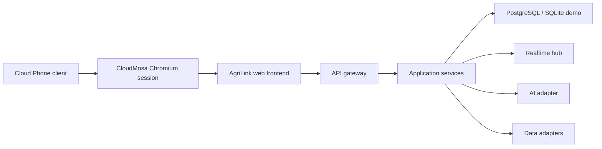

# AgriLink — Cloud Phone 農業協作平台

> **Competition Product Requirements Document v2.0**  
> Team: `dogbark-MeiChu`  
> Repository: https://github.com/dogbark-MeiChu/dogbark  
> Track: CloudMosa — 雲端運算 / 網頁開發 / 數位平權

---

## 0. Executive Decision

### 最終產品定位

**AgriLink 是為低價 4G 功能機打造的農業決策與協作平台。**

它把分散的行情、天氣、農業知識與附近供需，轉成可用方向鍵和數字鍵完成的短任務；同時用兩支功能機的即時互動與一款 server-authoritative 貪吃蛇，證明 Cloud Phone 不只可以「看內容」，也能承載即時、多用戶、雲端運算型應用。

### 一句話 Pitch

> **From keypad to market: trusted farm decisions, real-time local trade, and cloud gaming on a $15 phone.**

中文：

> **從按鍵到市場：讓 15 美元功能機也能取得可信農業決策、即時在地交易與雲端遊戲。**

### 我們不做什麼

- 不做真實支付、借貸、託管或投資功能。
- 不承諾「任何網站都能完美轉換」。
- 不讓 LLM 直接產生 HTML、控制導航或自行決定交易。
- 不把假資料包裝成即時官方行情。
- 不宣稱 AgriLink 是「全球第一」或低階手機「絕對做不到」多人應用。
- 不把 Roadmap 功能說成比賽當天已經完成。

### 競賽版真正要證明的三件事

1. **Decision**：把行情與運輸成本轉成可驗證的當前淨收益比較。
2. **Collaboration**：兩支 itel NEO R60+ 能即時發布供需、接收興趣通知。
3. **Cloud Compute**：兩支功能機能進行 server-authoritative 的 AgriSnake 貪吃蛇對戰。

這三件事分別對應：實用價值、商業價值、技術 wow factor。

---

## 1. 銳利評價：原始版本的真正問題

原始版本同時要求市集、論壇、任務、積分、AI、T9、三語、雙解析度、行情 API、WebSocket、遊戲與完整會員系統。這是產品 Roadmap，不是 30 小時內可以可靠交付的 MVP。

更需要修正的地方：

1. **「功能多」不等於公司級完整度**：成熟產品重視 scope、可靠性、資料責任、安全與可驗收性。
2. **「16MB RAM 永遠做不到多人同步」不準確**：真正優勢是 CloudMosa 讓低階裝置不必負擔完整瀏覽器與運算，不是多人網路在理論上只能存在雲端。
3. **不能假設 Widget JavaScript 可取得 IMEI**：Console IMEI 是測試裝置白名單，不應拿來當 Web 身分驗證。
4. **Soft Key mapping 原本寫得太武斷**：官方可靠路徑是 LSK 捕捉 `Escape`、RSK 使用 `back` event 或 `history.back()`；仍需真機校正。
5. **AI 不應預測「再等兩天賣」**：缺乏模型與資料時，這是假精準。競賽版改成 deterministic 淨收益比較，LLM 只負責解釋。
6. **P2P 市集有冷啟動、假單與信任問題**：需用 demo seed、到期時間、檢舉與未來 verified buyer 回答。
7. **遊戲若只是彩蛋會顯得硬塞**：貪吃蛇要明確扮演 cloud-compute proof 與留存層，不冒充農業核心價值。

成熟公司的完整度不是「什麼都塞」，而是：

- 核心價值清楚；
- 範圍與完成定義可驗收；
- 失敗狀況有處理；
- 資料來源可追溯；
- 安全、隱私與內容責任有界線；
- Demo 展示的內容與實際完成程度一致。

因此本文分成三層：

| 層級 | 定義 | 比賽策略 |
|---|---|---|
| Competition Core | 沒做完就不能上台 | 先完成、先上真機、反覆彩排 |
| Stretch | Core 穩定後才做 | 可展示，但不能阻塞主流程 |
| Company Roadmap | 上市產品所需能力 | 放進商業與產品藍圖，不假裝已完成 |

---

## 2. Product Thesis

### 2.1 使用者問題

對功能機農業用戶而言，問題通常不是網路上完全沒有資料，而是：

1. 資料分散在不同網站，格式複雜、字太多、操作不適合 keypad。
2. 市場報價沒有扣除距離、運費與數量，不能直接支持決策。
3. 在地供需與互助資訊不在通用 AI 的上下文裡。
4. 自由輸入成本高，尤其是在多語言與 T9 環境。
5. 低價手機上的 app 多以單向內容消費為主，缺少可信的任務式體驗。

### 2.2 CloudMosa 的客戶問題

CloudMosa 的直接商業客戶包括電信商、手機品牌與內容合作方。對這些客戶，AgriLink 必須帶來：

- 高頻且在地化的使用理由；
- 2G → 4G 升級故事；
- data-plan attachment 與持續使用；
- 可量測的留存與任務完成率；
- 與數位包容、農業服務及政府合作相容的產品敘事。

### 2.3 產品差異化

AgriLink 不是另一個 ChatGPT icon，也不是縮小版電商網站。它的差異是：

1. **Keypad-native task flows**：以任務與選項為中心，長文字輸入只是備援。
2. **Contextual calculation**：以地區、作物、數量與距離計算當前淨收益。
3. **Local network**：附近使用者的供需與通知由伺服器即時同步。
4. **Grounded AI**：AI 只解釋經過驗證的資料，答案保留來源與時間。
5. **Cloud interaction proof**：AgriSnake 用即時狀態同步展示雲端能力。

---

## 3. 商業模式與上市假設

### 3.1 商業模式：B2B2C

AgriLink 不直接向低收入功能機用戶收取高額訂閱費，而採：

- **Carrier bundle**：作為電信商農業／鄉村 4G data bundle 的預載 widget。
- **Platform licensing**：依 active subscriber 或月活裝置收取平台費。
- **Sponsored public service**：與農業部門、合作社、NGO 或農業內容商合作。
- **Verified marketplace placement**：未來可向經驗證的企業買家收取曝光或 lead fee；不得向農民收不透明佣金。

### 3.2 North-star metric

> **Weekly Useful Actions per Active Farmer (WUAAF)**

Useful Action 定義為以下任一事件：

- 完成一次淨收益比較；
- 發布或回應一筆供需；
- 查看一則有來源的 AI 建議；
- 設定一次行情／天氣提醒。

Snake session 不計入 WUAAF，避免遊戲時間美化核心產品價值；它單獨計入 retention engagement。

### 3.3 Pilot KPI

| 類型 | KPI |
|---|---|
| Adoption | widget activation rate、profile completion rate |
| Utility | WUAAF、net-price comparison completion、listing match rate |
| Retention | D1 / D7 / D30 retention、weekly sessions |
| Reliability | crash-free sessions、API success rate、p95 latency |
| Carrier | data-bundle attachment、4G upgrade conversion、incremental data usage |
| Trust | source-open rate、report rate、unsafe-answer rate |

不得在尚未進行 pilot 前宣稱 AgriLink 可以帶來固定比例的 ARPU 或收入成長。CloudMosa 的既有案例只能作為商業合理性的參考，不是本產品的因果證據。

---

## 4. Scope Control

### 4.1 Competition Core — 必須完成

| 模組 | 必須完成的證據 |
|---|---|
| Keypad Shell | 全程不用觸控；方向鍵、Enter、LSK、RSK、0–9、`*`、`#` 可操作 |
| Market Decision | 展示至少 3 個市場、資料時間、來源標籤與 deterministic 淨收益計算 |
| Local Market | A 發布；B 即時收到並送出 structured offer；A accept/counter；雙方確認 Deal Summary |
| Ask AI | 預設問題 + English multi-tap；答案經 schema 驗證並顯示來源／警語 |
| AgriSnake | 單人 Daily Run 必成；兩機 Duel 為同一套 server-authoritative engine |
| Resolutions | 240×320 完整；128×160 主流程可用 |
| Deployment | 公開 HTTPS、Cloud Phone Console 註冊、真機可開 |
| Reliability | AI、資料 API、WebSocket 任一失敗時不白屏且可退回安全路徑 |

### 4.2 Stretch — Core 全綠才做

- Web Simplifier Beta：三個測試來源 + 任意 URL 的受限 reader mode。
- Hindi 主選單、預設問題與 AI 回覆。
- AgriSnake Duel matchmaking、reconnect、每日排行榜。
- Farmer Circle 唯讀列表與一鍵回覆。
- 作物照片分析：只有確認相機／檔案選擇流程可用後才開啟。

### 4.3 Company Roadmap — 不列入競賽完成度

- 身分驗證與電信商 subscriber mapping。
- 商家／合作社驗證與反詐騙。
- 正式政府資料串接與資料授權。
- 內容審核、申訴、封鎖、稽核紀錄。
- 多市場 rollout、完整多語言、客服與營運後台。
- Carrier analytics、A/B testing、SLA 與 incident response。

---

## 5. Information Architecture

### 5.1 主選單

```text
┌────────────────────────┐
│ AGRILINK           ● 2 │
├────────────────────────┤
│ 1  Prices & Profit     │
│ 2  Local Market        │
│ 3  Ask AI              │
│ 4  Web Lite Beta       │
│ 5  Farmer Circle       │
│ 6  AgriSnake           │
├────────────────────────┤
│ Menu      Open     Back│
└────────────────────────┘
```

### 5.2 Screen tree

```text
AppBoot
├── Onboarding
│   ├── Language
│   ├── Region
│   └── Crops
└── MainMenu
    ├── PricesAndProfit
    │   ├── MarketDetail
    │   └── DataSources
    ├── LocalMarket
    │   ├── BrowseProduce
    │   ├── BuyerRequests
    │   ├── ListingDetail
    │   ├── CreateListing
    │   ├── CreateBuyRequest
    │   ├── MakeOffer
    │   ├── CounterOffer
    │   ├── DealSummary
    │   ├── PickupConfirmation
    │   ├── MyOffers
    │   ├── MyDeals
    │   └── MatchNotification
    ├── AskAI
    │   ├── PresetQuestions
    │   ├── T9Input
    │   ├── Answer
    │   └── Sources
    ├── WebLiteBeta
    │   ├── CuratedSources
    │   ├── URLInput
    │   ├── ReaderCards
    │   └── UnsupportedPage
    ├── FarmerCircle
    └── AgriSnake
        ├── DailyRun
        ├── DuelLobby
        ├── DuelGame
        └── Result
```

---

## 6. Keypad Interaction Contract

官方設計文件的可靠輸入基礎為方向鍵與 Enter；左功能鍵以 `Escape` 捕捉，右功能鍵預設對應 `history.back()` 或全域 `back` event。實機映射必須現場驗證，不能只假設 `SoftLeft` / `SoftRight` 字串存在。

參考：

- https://developer.cloudfone.com/docs/guides/cloud-phone-design/
- https://github.com/cloudfonecom/cloudfone-starter

### 6.1 統一操作語義

| 實體按鍵 | Web event / handling | 全域語義 |
|---|---|---|
| ↑ ↓ ← → | Arrow keys | 焦點移動／遊戲方向 |
| Enter | `Enter` | 選取／確認 |
| Left Soft Key | 優先監聽 `Escape` | Options / Menu |
| Right Soft Key | `back` event 或 history | Back / Exit |
| 0–9 | 數字 key | 選單快捷、T9、數值輸入 |
| `*` | `*` | 刪除／切換模式，依畫面標示 |
| `#` | `#` | 送出／Sources，依畫面標示 |

### 6.2 Key normalization

```ts
export type Action =
  | "UP" | "DOWN" | "LEFT" | "RIGHT" | "ENTER"
  | "OPTIONS" | "BACK"
  | "NUM_0" | "NUM_1" | "NUM_2" | "NUM_3" | "NUM_4"
  | "NUM_5" | "NUM_6" | "NUM_7" | "NUM_8" | "NUM_9"
  | "STAR" | "HASH";

export function normalizeKey(event: KeyboardEvent): Action | null {
  const map: Record<string, Action> = {
    ArrowUp: "UP",
    ArrowDown: "DOWN",
    ArrowLeft: "LEFT",
    ArrowRight: "RIGHT",
    Enter: "ENTER",
    Escape: "OPTIONS",
    "0": "NUM_0", "1": "NUM_1", "2": "NUM_2",
    "3": "NUM_3", "4": "NUM_4", "5": "NUM_5",
    "6": "NUM_6", "7": "NUM_7", "8": "NUM_8",
    "9": "NUM_9", "*": "STAR", "#": "HASH"
  };
  return map[event.key] ?? null;
}

window.addEventListener("back", (event) => {
  if (router.canGoBack()) {
    event.preventDefault();
    router.back();
  }
});
```

實機第一次測試必須建立 Key Inspector 畫面，記錄 `key`、`code`、keydown/keyup 與長按 repeat 行為。

### 6.3 Focus rules

- 同一時間只有一個 focus target。
- 進入新畫面時焦點落在第一個主要 action。
- 返回上一頁時恢復原焦點，而不是跳回第一列。
- 焦點不可落在畫面外；列表需自動捲動。
- 128×160 每頁最多 3 個主要 action。
- 色彩不可成為唯一焦點提示；同時使用反白／外框。

---

## 7. Core User Journeys

### 7.1 Prices & Profit

#### 目的

回答「現在到哪個市場賣，扣掉成本後實收較高？」而不是做無根據的價格預測。

```text
RICE · 5 QUINTAL

1 Rampur   ₹2,240/q
  Cost       -₹35/q
  Net      ₹2,205/q

2 Dhanpur  ₹2,310/q
  Cost       -₹72/q
  Net      ₹2,238/q  BEST

Updated 10:30
Menu    Explain    Back
```

#### 計算

```text
net_unit_price = quoted_price - transport_cost_per_unit - market_fee_per_unit
estimated_net_proceeds = net_unit_price × quantity
incremental_gain = best_market_proceeds - local_market_proceeds
```

#### 信任要求

- 每筆價格顯示來源類型、更新時間與 demo/live 狀態。
- Demo dataset 必須標示 `DEMO DATA`。
- LLM 只能將 deterministic 計算解釋成短句；不得自行修改數字。
- 不顯示「保證獲利」「兩天後一定上漲」等內容。

### 7.2 Local Market

#### Product definition

Local Market is a **low-bandwidth, location-aware produce matching service**. It is not a regulated commodity exchange, payment processor, escrow service, delivery company, or quality inspection authority.

Competition flow:

```text
Discover → Offer → Counter/Accept → Confirm Terms → Schedule Pickup
→ Offline Payment/Handover → Both Confirm → Complete
```

Do not use these labels in the competition build:

```text
Commodity Exchange
Order Book
Checkout
Pay Now
Escrow
Payment Secured
Guaranteed Trade
```

Use these labels instead:

```text
Local Market
Sell Produce
Buyer Requests
Make Offer
Confirm Terms
Pickup
Mark Received
Mark Paid
```

#### Why this is not an order book

Do not implement a stock-style bid/ask order book. Farm produce is not automatically fungible: variety, grade, freshness, harvest date, moisture, packaging, location, transport and actual delivered weight may differ. A true order book would also imply standardized contracts, inspection, settlement, liquidity and enforcement that AgriLink does not provide.

Instead, each listing has its own structured offer list. Optional time-window bidding for large standardized lots belongs in P2, not competition P0.

#### Market home

```text
AGRILINK MARKET
Patna · Within 25 km

1 Browse Produce
2 Buyer Requests
3 Sell Produce
4 Post Buy Request
5 My Offers
6 My Deals
7 Saved
8 Market Prices

L: Filters       R: Menu
```

128×160 fallback:

```text
LOCAL MARKET

1 Browse
2 Requests
3 Post
4 My Deals
5 More
```

#### Location model — never use IP as the market boundary

Do not decide marketplace eligibility or district from request IP. In Cloud Phone, traffic may originate from a cloud-rendering/data-center address rather than the farmer. Mobile carriers may also use carrier-grade NAT, and VPN/proxy use makes IP geolocation unreliable.

Location priority:

1. User-selected country/state/district during onboarding.
2. Farm profile coordinates.
3. Device geolocation only after explicit permission.
4. IP only as a security/risk signal; never as the source of truth for listing visibility.

Default discovery scopes:

```text
1 Nearby · 25 km
2 My District
3 Neighboring Districts
4 Entire State
```

Default to `My District` or 25 km, but do not hard-block expansion. Fresh produce may need a narrow radius while grain can reasonably travel farther. Store `district_code`, approximate latitude/longitude and fulfillment method on the listing.

Public cards show only approximate location:

```text
Patna District · about 12 km
```

Never expose exact farm coordinates, home address, full phone number or identity documents in a public listing. Reveal the agreed pickup location/contact channel only after both parties confirm terms.

#### Sell Produce listing

```text
POST PRODUCE

Crop      Rice
Quantity  5 q
Price     ₹2,250/q · Neg.
Grade     A
Ready     22 Sep
Area      Patna
Method    Pickup
Expires   48 h

# Post       Back
```

Required fields:

- Crop.
- Variety, optional.
- Quantity and unit (`kg`, `bag`, `crate`, `quintal`, `ton`).
- Pricing mode.
- Asking price and currency when applicable.
- Grade/condition using configured choices plus `Not graded`.
- Harvested/available date.
- Pickup, seller delivery, or negotiable fulfillment.
- District and approximate coordinates when permitted.
- Expiry.
- Up to three optional photos.

主要欄位使用預設選項與數字輸入，避免長句 T9。Do not require a photo because the target user may have limited camera access or bandwidth.

Pricing modes:

```text
1 Fixed Price
2 Negotiable
3 Request Offers
```

`Request Offers` is not an auction. It collects private offers until the seller accepts, rejects or the listing expires.

#### Buyer Request

Buyers can publish structured demand instead of waiting for a seller listing:

```text
BUYING

Rice · Grade A
Need       500 kg
Budget     ₹32–35/kg
Before     25 Sep
Area       Patna
Method     Buyer pickup
```

Required fields:

- Crop and optional variety.
- Desired grade/condition.
- Quantity and unit.
- Target price or price range, optional.
- Needed-by date.
- Pickup/delivery preference.
- District and discovery scope.
- Expiry.

Competition P0 permits registered users to act as buyer or seller. `Verified Buyer` is a future operational verification state and must not be faked in the demo.

#### Browse card

```text
SELLING · 12 km
Tomatoes · Grade A
120 kg · ₹28/kg
Ready tomorrow
Patna · Pickup

Enter Details
```

Filters:

```text
Type: Selling / Buying
Crop
Distance or district
Ready/needed date
Price range
Fulfillment
```

Sorting:

```text
Nearest
Newest
Lowest asking price
Ready soonest
```

Do not label asking prices as verified market prices. Link to `Prices & Profit` for timestamped reference data.

#### Make Offer

An offer is structured, not a free-form `Interested` click:

```text
MAKE OFFER

Quantity   100 kg
Price      ₹27/kg
Pickup     22 Sep
Window     09:00–11:00
Crates     Buyer brings

# Send       Back
```

Offer actions:

```text
1 Accept
2 Counter
3 Decline
4 View Profile
5 Report
```

A counter-offer creates a new immutable offer revision. Never overwrite the previous price/quantity because the negotiation history is part of the audit trail.

#### Deal state machine

```text
OPEN
  → OFFERED
  → COUNTERED
  → AGREED
  → PICKUP_SCHEDULED
  → HANDED_OVER
  → COMPLETED
```

Exceptional terminal or side states:

```text
EXPIRED
CANCELLED
NO_SHOW
DISPUTED
REMOVED
```

Server-side rules:

- Only the listing owner can accept, counter or decline an incoming offer.
- Buyer and seller must separately confirm the final terms before `AGREED`.
- Accepting one offer reserves only its agreed quantity; support partial quantity safely.
- Prevent total reserved/completed quantity from exceeding listing quantity.
- Expired/removed listings cannot receive new offers.
- Completion requires separate buyer-received and seller-paid/handover confirmations.
- Every status change appends an audit event.

#### Deal Summary

```text
DEAL #A1042

Tomatoes · Grade A
Quantity: 100 kg
Price: ₹27/kg
Est. total: ₹2,700

22 Sep · 09:00–11:00
Patna Central Market
Cash on pickup

Buyer confirmed  ✓
Seller confirmed ✓
```

Use `Estimated total` because final agricultural weight may be measured during handover. Freeze an immutable snapshot of the accepted terms so later listing edits cannot change an agreed deal.

Both sides see:

```text
CONFIRM TERMS?

1 Confirm
2 Request Change
3 Cancel
```

Required disclosure:

> AgriLink connects buyers and sellers. It does not process payments, inspect goods, guarantee quality, or guarantee completion.

Do not universally claim that the Deal Summary is legally binding or non-binding; legal effect varies by jurisdiction. Describe it as a record of the terms confirmed by both users.

#### Offline payment and handover

Supported coordination choices:

```text
1 Cash on pickup
2 Mobile money outside AgriLink
3 Bank transfer outside AgriLink
4 Pay after delivery
```

AgriLink must not:

- Collect bank credentials, card information, PIN or OTP.
- Display `Payment secured` or `Escrow`.
- Automatically infer payment from a screenshot.
- Claim buyer or seller protection.

At `PICKUP_SCHEDULED`, generate a random four-digit pickup code visible to the buyer. Seller enters it at handover:

```text
PICKUP CODE
4 8 2 1
```

The code confirms an in-person handover interaction, not product quality or payment. Buyer separately marks goods received; seller separately marks payment received or payment pending. Only users in a completed deal can rate one another.

#### Realtime proof

1. Device A 發布 listing。
2. Backend 儲存並廣播 `listing.created`。
3. Device B 的同區域 feed 出現新 listing。
4. Device B 送出有數量、單價和取貨時間的 offer。
5. Device A 收到 `offer.created`，選擇 Accept 或 Counter。
6. 雙方分別確認 Deal Summary。
7. Backend 廣播 `deal.agreed`，兩支裝置同步顯示取貨安排。

#### 邊界

- 比賽版只做農產品供需撮合，不公開私人電話、不處理付款、不承諾物流或履約。
- P0 只允許一般農產品；農藥、受管制化學品、藥品、活體牲畜與其他高風險商品不開放。
- 所有 listing/request 有到期時間、來源使用者、封鎖與檢舉入口。
- 建立 listing、buyer request、offer 都需要登入。
- 同一帳號和 IP 可做 rate limiting，但 IP 不可作地區判斷或唯一身分依據。
- Company Roadmap 才加入企業買家驗證、內容審核營運、金流合作、物流與正式 dispute resolution。

#### Minimum abuse controls

- Farm ID/profile identity plus authenticated session.
- Per-user creation and offer rate limits.
- Duplicate/spam detection using normalized crop, price, quantity and time window.
- Block user, report listing, report deal and cancel reason.
- Hide removed content while preserving audit metadata.
- Rating only after bilateral completion.
- Never display a fake `Verified` badge in seeded demo data.

#### Implementation dependencies

Basic listing, buyer request, offer and deal CRUD require no special marketplace package; Express and SQLite are sufficient.

Recommended only when not already present:

```text
ws                  realtime events; reuse existing WebSocket layer
multer              optional listing photo upload
zod                 request/schema validation
express-rate-limit  spam and brute-force controls
helmet              baseline HTTP security headers
```

Distance filtering does not require an IP-geolocation package. For competition scale, query by district/bounding box and compute Haversine distance in the backend. Do not add Google Maps, PostGIS, Elasticsearch or Redis solely for this feature.

### 7.3 Ask AI

```text
ASK AGRILINK

1 Check crop symptom
2 Explain market price
3 Weather action
4 Find public support
5 Type with T9

Menu      Select     Back
```

AI 回答格式：

```text
YELLOW LEAVES

Possible cause:
Nitrogen deficiency

Next:
Check lower leaves and soil.
Do not apply chemicals yet.

Confidence: Medium
# Sources             Back
```

高風險答案必須使用保守語言，並建議當地專業人員確認。

### 7.4 Web Lite Beta

#### 定位

把公開資訊頁轉成 keypad-first reader cards，而不是宣稱能重做整個網際網路。

#### Competition demo

```text
WEB LITE BETA

1 Crop price bulletin
2 Weather advisory
3 Government support
4 Enter a URL
```

前三項為已驗證來源；第四項為受限 Beta。

#### Pipeline

```text
URL
→ safe fetch
→ content extraction
→ prompt-injection filtering
→ LLM structured summary
→ schema validation
→ fixed reader-card UI
```

#### 安全限制

- 只允許 `https`。
- DNS resolution 後阻擋 localhost、private IP、link-local、metadata endpoints。
- 不轉送使用者 cookies、Authorization header 或登入 session。
- 限制 redirect 次數、下載大小、content type 與 timeout。
- 不自動提交表單、不代替使用者付款、不繞過 CAPTCHA／paywall。
- 網頁文字永遠視為不可信資料，不得覆寫 system rules。
- 無法解析時顯示 `Unsupported page`，不可生成假摘要。

### 7.5 Farmer Circle

Competition Core 只需要：

- 顯示 3–5 則 seed posts；
- 顯示地區與時間；
- `Helpful` 一鍵反應；
- `Ask AI to summarize`；
- AI 失敗時仍可閱讀原文。

發文、回覆、審核、封鎖與檢舉是 Stretch / Roadmap，不阻塞核心 demo。

---

## 8. AgriSnake — 貪吃蛇留存與技術展示

### 8.1 為什麼一定是貪吃蛇

貪吃蛇符合功能機的操作模型：四方向鍵、規則一眼可懂、畫面可縮放、沒有文字輸入障礙。它同時能展示：

- 低解析度 rendering；
- 即時鍵盤事件；
- server tick、房間、同步與斷線恢復；
- 兩台低價裝置共享同一雲端狀態。

遊戲不是 AgriLink 的核心社會價值，也不拿來掩蓋農業功能；它是技術 proof 與非核心留存層。

### 8.2 遊戲模式

#### Mode A — Daily Run（Competition Core）

- 單人貪吃蛇。
- 固定 seed 的 Daily Challenge，所有玩家面對相同地圖。
- 吃作物得分；碰牆／自己結束。
- 完成後可上傳分數。
- 即使 Duel 當天失敗，仍有完整可玩的遊戲。

#### Mode B — Cloud Duel（Competition Wow）

- 兩支手機進同一房間。
- 每位玩家控制自己的蛇。
- 吃作物增長；碰牆、自己或對方蛇身判負。
- 90 秒上限；都存活則以分數判勝。
- 所有碰撞、食物生成、分數與勝負由伺服器決定。

### 8.3 遊戲畫面

```text
┌────────────────────────┐
│ YOU 04     01 OPP      │
├────────────────────────┤
│ · · · ■ ■ · · ○ · ·   │
│ · · · · ■ · · · · ·   │
│ · ● · · ■ · · □ □ ·   │
│ · · · · · · · · □ ·   │
│ · · ▲ · · · · · □ ·   │
├────────────────────────┤
│ Exit        01:12      │
└────────────────────────┘
```

- `■`：你的蛇。
- `□`：對手蛇。
- `●`：作物／食物。
- `○`：bonus。
- `▲`：hazard；QQVGA 可移除 hazard，降低視覺密度。

### 8.4 Server-authoritative simulation

Cloud Phone 的遠端架構存在輸入與畫面更新 RTT，不應照桌面遊戲做 60 FPS。競賽版目標：

| 參數 | 初始值 | 備註 |
|---|---:|---|
| Server tick | 6 Hz | 實機量測後可調 5–8 Hz |
| Snapshot | 每 tick | payload 很小；後續可降至 3 Hz |
| Input buffer | 2 個方向 | 避免快速轉彎遺失 |
| Reconnect window | 5 秒 | 期間規則固定，不由 client 決定 |
| Match duration | 90 秒 | 適合 demo 與低網路成本 |

#### Server state

```ts
type SnakeRoom = {
  id: string;
  seed: number;
  tick: number;
  status: "waiting" | "running" | "finished";
  food: Point[];
  hazards: Point[];
  players: Record<string, {
    body: Point[];
    direction: Direction;
    queuedDirection?: Direction;
    score: number;
    alive: boolean;
    lastInputSeq: number;
  }>;
};
```

#### Client input

```json
{
  "type": "snake.input",
  "roomId": "demo-01",
  "seq": 18,
  "direction": "LEFT"
}
```

#### Server snapshot

```json
{
  "type": "snake.snapshot",
  "roomId": "demo-01",
  "tick": 142,
  "food": [[5, 7]],
  "players": {
    "a": { "body": [[3,4],[3,5]], "score": 4, "alive": true },
    "b": { "body": [[8,8],[8,9]], "score": 1, "alive": true }
  }
}
```

### 8.5 Fairness and safety

- 禁止方向直接反轉，伺服器拒絕非法 input。
- 伺服器使用 monotonic tick，不相信 client timestamp。
- Daily score 只接受合法 session 的 server result。
- 積分不可購買、不可換現金、不可用於抽獎，避免形成賭博或 dark pattern。
- Game analytics 與農業 utility metrics 分開報告。

### 8.6 Snake 驗收

- [ ] 方向鍵連續操作 3 分鐘不失焦。
- [ ] 240×320 與 128×160 都看得清楚。
- [ ] 碰撞由 server 判定，client 修改分數無效。
- [ ] 兩 session 看到相同食物、蛇身、分數與結果。
- [ ] 斷線時顯示 reconnect，不凍結整個 app。
- [ ] Duel 失敗時 Daily Run 仍可玩。

---

## 9. AI and LLM Contract

### 9.1 LLM 的職責

LLM 可以：

- 將複雜資料壓縮成短句；
- 將問題分類到固定 intent；
- 解釋 deterministic 計算；
- 翻譯已驗證內容；
- 對公開網頁做受限摘要。

LLM 不可以：

- 決定價格、運費、分數或交易狀態；
- 直接生成 HTML／JavaScript；
- 自動送出表單或交易；
- 在沒有資料時捏造行情／補助；
- 把一般建議包裝成診斷或保證。

### 9.2 Provider abstraction

```ts
interface LLMProvider {
  generateStructured<T>(request: {
    task: "intent" | "explain" | "advice" | "translate" | "web_summary";
    context: Record<string, unknown>;
    input: string;
    schema: JSONSchema;
    targetLanguage: string;
  }): Promise<T>;
}
```

可切換 Gemini / OpenAI；金鑰只存在 server environment，不送到前端。

### 9.3 Answer schema

```json
{
  "intent": "crop_guidance",
  "headline": "Possible nitrogen issue",
  "summary": "Check lower leaves and soil moisture.",
  "actions": [
    { "label": "Inspect", "detail": "Compare old and new leaves." }
  ],
  "confidence": "medium",
  "source_ids": ["kb-rice-014"],
  "safety_note": "Confirm locally before applying chemicals."
}
```

### 9.4 Reliability controls

- Server timeout：5 秒。
- 僅對同一 normalized question 使用安全 cache。
- JSON schema 驗證失敗只重試一次。
- 第二次失敗回固定 fallback，不把 raw model output 顯示給用戶。
- 記錄 provider、model、latency、schema result、source IDs；不記錄不必要的個資。
- Demo 前準備預設問題的 verified fallback。

---

## 10. T9 Input

### 10.1 原則

自由 T9 保留，因為它能展示 keypad engineering；但主流程必須可以用預設選項完成，不能要求評審現場打長句。

### 10.2 English multi-tap

```text
1 . , ? !    2 a b c    3 d e f
4 g h i      5 j k l    6 m n o
7 p q r s    8 t u v    9 w x y z
0 space      * delete   # submit
```

- 700ms timeout 或不同鍵確認字母。
- 長按是否可靠必須上真機測試；若 repeat event 不穩，不提供長按數字功能。
- Ask AI 上限 80 字；Circle post 上限 160 字。
- Hindi / Bengali 第一版使用預設問題，不自製複雜 script IME。

### 10.3 Optional predictive layer

`7246` → `RAIN / PAIN`，方向鍵選字。此功能不得阻塞基本 multi-tap。

---

## 11. Technical Architecture

### 11.1 Runtime architecture



### 11.2 Competition stack

| Layer | Choice | Reason |
|---|---|---|
| Frontend | Official Cloudfone starter + Next.js/TypeScript | 官方 breakpoints、layout 與 keyboard primitives，降低整合風險 |
| API | Node.js 20 + Fastify or Express + TypeScript | 快速、可驗證 schema |
| Realtime | WebSocket (`ws`) + 3–5 秒 polling fallback | listing 與 Snake 共用 |
| Database | SQLite in competition; PostgreSQL in production | Demo 零設定；上市版支援併發與備援 |
| Validation | Zod / AJV | API 與 LLM schema |
| Reverse proxy | nginx | TLS、靜態資源、WS upgrade、rate limit |
| Process | systemd or PM2 | restart 與 log |
| Monitoring | structured logs + health endpoint | Demo 與事故定位 |

不再以「零 dependency」作為品質指標。比賽版要少依賴，但輸入驗證、型別與官方元件比手寫所有基礎設施更可靠。

### 11.3 Repository structure

```text
dogbark/
├── apps/
│   ├── widget/
│   │   ├── src/app/
│   │   ├── src/features/
│   │   │   ├── prices/
│   │   │   ├── listings/
│   │   │   ├── ai/
│   │   │   ├── web-lite/
│   │   │   └── snake/
│   │   └── src/platform/
│   │       ├── keypad/
│   │       ├── focus/
│   │       ├── routing/
│   │       └── i18n/
│   └── api/
│       ├── src/routes/
│       ├── src/services/
│       ├── src/realtime/
│       └── src/security/
├── packages/
│   ├── contracts/
│   └── demo-data/
├── infra/
│   ├── nginx/
│   └── systemd/
├── docs/
│   ├── demo-runbook.md
│   ├── data-provenance.md
│   └── threat-model.md
├── proposal.md
└── README.md
```

---

## 12. API Contract

Base URL：`https://<domain>/api/v1`

### 12.1 Session

Cloud Phone Console 的 IMEI 是實體測試裝置白名單，不代表 widget JavaScript 能取得 IMEI。Competition build 不得把 IMEI 當 web authentication credential。

比賽版使用：

- 第一次啟動由 server 發 anonymous demo session；
- client 儲存 opaque session token；
- Demo 兩台手機使用不同預設角色 A/B；
- Production 改接 carrier-approved identity mechanism。

| Method | Path | Purpose |
|---|---|---|
| POST | `/sessions/anonymous` | 建立 demo session |
| GET | `/me` | 取得 profile |
| PATCH | `/me` | 更新 region、crop、language |

### 12.2 Prices

| Method | Path | Purpose |
|---|---|---|
| GET | `/prices?crop=&region=` | 價格、來源與更新時間 |
| POST | `/profit/compare` | 伺服器計算各市場淨收益 |
| GET | `/sources/:id` | 顯示資料 provenance |

### 12.3 Local Market

| Method | Path | Purpose |
|---|---|---|
| GET | `/market/listings?district=&radius_km=&crop=&sort=&cursor=` | Browse seller listings |
| POST | `/market/listings` | 建立 Sell Produce listing |
| GET | `/market/listings/:id` | Listing detail and available quantity |
| PATCH | `/market/listings/:id` | Owner edits non-agreed listing fields |
| DELETE | `/market/listings/:id` | Owner removes listing; preserve audit event |
| GET | `/market/buy-requests?district=&radius_km=&crop=&cursor=` | Browse structured buyer demand |
| POST | `/market/buy-requests` | 建立 Buyer Request |
| GET | `/market/buy-requests/:id` | Buyer Request detail |
| PATCH | `/market/buy-requests/:id` | Owner edits open request |
| POST | `/market/listings/:id/offers` | Buyer makes structured offer |
| POST | `/market/buy-requests/:id/offers` | Seller responds to buyer demand |
| GET | `/market/offers?role=incoming|outgoing&cursor=` | My Offers |
| GET | `/market/offers/:id` | Offer and immutable revisions |
| POST | `/market/offers/:id/counter` | Create counter-offer revision |
| POST | `/market/offers/:id/accept` | Owner accepts current offer revision |
| POST | `/market/offers/:id/decline` | Decline offer with optional reason |
| POST | `/market/deals/:id/confirm` | Buyer/seller separately confirms terms |
| POST | `/market/deals/:id/schedule` | Agree pickup window and approximate place |
| POST | `/market/deals/:id/verify-pickup` | Seller verifies four-digit handover code |
| POST | `/market/deals/:id/received` | Buyer marks goods received |
| POST | `/market/deals/:id/payment-status` | Seller records paid/pending; no money movement |
| POST | `/market/deals/:id/cancel` | Cancel with actor and reason |
| GET | `/market/deals?status=&cursor=` | My Deals |
| POST | `/market/reports` | Report listing, request, offer, deal or user |
| POST | `/market/users/:id/block` | Block another user |

Listing creation example:

```json
{
  "crop": "tomato",
  "variety": "roma",
  "quantity": 120,
  "unit": "kg",
  "pricingMode": "negotiable",
  "askingPrice": 28,
  "currency": "INR",
  "grade": "A",
  "availableDate": "2026-09-22",
  "fulfillment": "pickup",
  "districtCode": "IN-BR-PATNA",
  "latitude": 25.5941,
  "longitude": 85.1376,
  "expiresAt": "2026-09-21T18:00:00+05:30"
}
```

Offer creation example:

```json
{
  "quantity": 100,
  "unitPrice": 27,
  "currency": "INR",
  "pickupDate": "2026-09-22",
  "pickupWindowStart": "09:00",
  "pickupWindowEnd": "11:00",
  "paymentMethod": "cash_on_pickup",
  "note": "Buyer brings 10 crates"
}
```

The backend calculates estimated totals, remaining quantities, distance and permissions. Never trust client-submitted totals, ownership, rating eligibility or status transitions.

### 12.4 AI and Web Lite

| Method | Path | Purpose |
|---|---|---|
| POST | `/ai/answers` | 預設或 T9 問題；回結構化答案 |
| POST | `/web-lite/preview` | 受限 URL 擷取與摘要 |

### 12.5 Snake

| Method | Path | Purpose |
|---|---|---|
| POST | `/snake/daily` | 建立 Daily Run |
| POST | `/snake/rooms` | 建立 Duel room |
| POST | `/snake/rooms/:id/join` | 加入房間 |
| GET | `/snake/leaderboard/daily` | 當日排行榜 |

### 12.6 Error envelope

```json
{
  "error": {
    "code": "SOURCE_UNAVAILABLE",
    "message": "Live source unavailable.",
    "retryable": true,
    "request_id": "req_abc123"
  }
}
```

---

## 13. Realtime Contract

### 13.1 Connection

```text
wss://<domain>/realtime?session=<opaque-token>
```

token 不放長期 secret，存活時間短且可撤銷。

### 13.2 Events

```text
listing.created
buy_request.created
offer.created
offer.countered
offer.accepted
offer.declined
deal.awaiting_confirmation
deal.agreed
deal.pickup_scheduled
deal.handover_verified
deal.completed
deal.cancelled
notification.created
snake.room.state
snake.countdown
snake.snapshot
snake.finished
```

所有 message 具備：

```json
{
  "type": "listing.created",
  "version": 1,
  "event_id": "evt_123",
  "server_time": "2026-09-19T10:30:00Z",
  "data": {}
}
```

### 13.3 Recovery

- WS disconnect → 顯示狀態，不默默假裝在線。
- Listing flow → 退化為 3–5 秒 polling。
- Snake Duel → 嘗試 5 秒 reconnect；失敗則 server 結束或判定 no contest。
- 每個 event 具 event_id，client 去重。

---

## 14. Data Model

Competition 版至少需要：

```sql
CREATE TABLE users (
  id TEXT PRIMARY KEY,
  display_name TEXT NOT NULL,
  region_code TEXT NOT NULL,
  district_code TEXT,
  latitude REAL,
  longitude REAL,
  crops_json TEXT NOT NULL,
  language TEXT NOT NULL DEFAULT 'en',
  created_at TEXT NOT NULL
);

CREATE TABLE listings (
  id TEXT PRIMARY KEY,
  seller_id TEXT NOT NULL REFERENCES users(id),
  crop TEXT NOT NULL,
  variety TEXT,
  quantity REAL NOT NULL CHECK(quantity > 0),
  unit TEXT NOT NULL,
  pricing_mode TEXT NOT NULL CHECK(pricing_mode IN ('fixed','negotiable','request_offers')),
  asking_price REAL CHECK(asking_price >= 0),
  currency TEXT NOT NULL,
  grade TEXT NOT NULL DEFAULT 'not_graded',
  available_date TEXT NOT NULL,
  fulfillment TEXT NOT NULL CHECK(fulfillment IN ('pickup','seller_delivery','negotiable')),
  district_code TEXT NOT NULL,
  latitude REAL,
  longitude REAL,
  public_location_label TEXT NOT NULL,
  status TEXT NOT NULL CHECK(status IN ('draft','open','partially_reserved','reserved','sold','expired','removed')),
  expires_at TEXT NOT NULL,
  updated_at TEXT NOT NULL,
  created_at TEXT NOT NULL
);

CREATE INDEX idx_listings_discovery
  ON listings (district_code, crop, status, available_date, created_at DESC);

CREATE TABLE buy_requests (
  id TEXT PRIMARY KEY,
  buyer_id TEXT NOT NULL REFERENCES users(id),
  crop TEXT NOT NULL,
  variety TEXT,
  desired_grade TEXT NOT NULL DEFAULT 'not_specified',
  quantity REAL NOT NULL CHECK(quantity > 0),
  unit TEXT NOT NULL,
  target_price_min REAL CHECK(target_price_min >= 0),
  target_price_max REAL CHECK(target_price_max >= 0),
  currency TEXT NOT NULL,
  needed_by TEXT NOT NULL,
  fulfillment TEXT NOT NULL CHECK(fulfillment IN ('buyer_pickup','seller_delivery','negotiable')),
  district_code TEXT NOT NULL,
  latitude REAL,
  longitude REAL,
  status TEXT NOT NULL CHECK(status IN ('draft','open','matched','expired','removed')),
  expires_at TEXT NOT NULL,
  updated_at TEXT NOT NULL,
  created_at TEXT NOT NULL,
  CHECK(target_price_max IS NULL OR target_price_min IS NULL OR target_price_max >= target_price_min)
);

CREATE INDEX idx_buy_requests_discovery
  ON buy_requests (district_code, crop, status, needed_by, created_at DESC);

CREATE TABLE market_offers (
  id TEXT PRIMARY KEY,
  listing_id TEXT REFERENCES listings(id),
  buy_request_id TEXT REFERENCES buy_requests(id),
  proposer_id TEXT NOT NULL REFERENCES users(id),
  recipient_id TEXT NOT NULL REFERENCES users(id),
  current_revision INTEGER NOT NULL DEFAULT 1,
  status TEXT NOT NULL CHECK(status IN ('open','countered','accepted','declined','withdrawn','expired')),
  expires_at TEXT,
  updated_at TEXT NOT NULL,
  created_at TEXT NOT NULL,
  CHECK((listing_id IS NOT NULL AND buy_request_id IS NULL) OR
        (listing_id IS NULL AND buy_request_id IS NOT NULL))
);

CREATE TABLE market_offer_revisions (
  id TEXT PRIMARY KEY,
  offer_id TEXT NOT NULL REFERENCES market_offers(id),
  revision_number INTEGER NOT NULL,
  proposed_by TEXT NOT NULL REFERENCES users(id),
  quantity REAL NOT NULL CHECK(quantity > 0),
  unit_price REAL NOT NULL CHECK(unit_price >= 0),
  currency TEXT NOT NULL,
  pickup_date TEXT NOT NULL,
  pickup_window_start TEXT,
  pickup_window_end TEXT,
  payment_method TEXT NOT NULL CHECK(payment_method IN ('cash_on_pickup','external_mobile_money','external_bank_transfer','pay_after_delivery')),
  note TEXT,
  created_at TEXT NOT NULL,
  UNIQUE(offer_id, revision_number)
);

CREATE TABLE market_deals (
  id TEXT PRIMARY KEY,
  offer_id TEXT NOT NULL UNIQUE REFERENCES market_offers(id),
  listing_id TEXT REFERENCES listings(id),
  buy_request_id TEXT REFERENCES buy_requests(id),
  buyer_id TEXT NOT NULL REFERENCES users(id),
  seller_id TEXT NOT NULL REFERENCES users(id),
  terms_snapshot_json TEXT NOT NULL,
  estimated_total REAL NOT NULL CHECK(estimated_total >= 0),
  currency TEXT NOT NULL,
  buyer_confirmed_at TEXT,
  seller_confirmed_at TEXT,
  pickup_location_private TEXT,
  pickup_code_hash TEXT,
  handover_verified_at TEXT,
  buyer_received_at TEXT,
  seller_payment_status TEXT CHECK(seller_payment_status IN ('pending','received','not_applicable')),
  seller_payment_updated_at TEXT,
  status TEXT NOT NULL CHECK(status IN ('awaiting_confirmation','agreed','pickup_scheduled','handed_over','completed','cancelled','no_show','disputed')),
  completed_at TEXT,
  updated_at TEXT NOT NULL,
  created_at TEXT NOT NULL,
  CHECK(buyer_id <> seller_id)
);

CREATE TABLE market_reports (
  id TEXT PRIMARY KEY,
  reporter_id TEXT NOT NULL REFERENCES users(id),
  target_type TEXT NOT NULL CHECK(target_type IN ('listing','buy_request','offer','deal','user')),
  target_id TEXT NOT NULL,
  reason_code TEXT NOT NULL,
  details TEXT,
  status TEXT NOT NULL DEFAULT 'open' CHECK(status IN ('open','reviewed','dismissed','actioned')),
  created_at TEXT NOT NULL
);

CREATE TABLE market_prices (
  id TEXT PRIMARY KEY,
  crop TEXT NOT NULL,
  market_code TEXT NOT NULL,
  market_name TEXT NOT NULL,
  price REAL NOT NULL,
  unit TEXT NOT NULL,
  currency TEXT NOT NULL,
  observed_at TEXT NOT NULL,
  source_id TEXT NOT NULL,
  data_mode TEXT NOT NULL CHECK(data_mode IN ('live','cached','demo'))
);

CREATE TABLE snake_matches (
  id TEXT PRIMARY KEY,
  mode TEXT NOT NULL CHECK(mode IN ('daily','duel')),
  seed INTEGER NOT NULL,
  state_json TEXT NOT NULL,
  status TEXT NOT NULL,
  winner_user_id TEXT,
  started_at TEXT,
  finished_at TEXT
);

CREATE TABLE audit_events (
  id TEXT PRIMARY KEY,
  actor_id TEXT,
  action TEXT NOT NULL,
  entity_type TEXT,
  entity_id TEXT,
  request_id TEXT,
  created_at TEXT NOT NULL
);
```

Competition demo 不儲存 IMEI；也不把 API key、完整 prompt 或私人聯絡資訊寫進資料庫。

---

## 15. Security, Privacy and Trust

### 15.1 Threat model

| Threat | Control |
|---|---|
| 惡意 URL / SSRF | URL parser、DNS/IP blocklist、egress allow rules、timeout、size limit |
| Prompt injection | 網頁視為 untrusted content、固定 system policy、schema validation |
| 假 listing / spam | rate limit、expires_at、report、production verification |
| Client 竄改分數 | Snake server-authoritative、input validation、audit event |
| Session 被猜中 | high-entropy opaque token、TTL、TLS、rotation |
| API abuse | per-session/IP rate limit、request size limit |
| LLM key 外洩 | server-side environment secret，不進前端 bundle／Git |
| 個資過度蒐集 | competition build 不收電話、精確地址、IMEI |

### 15.2 Content policy

- 農業建議標示資訊用途，不取代當地農業／醫療／法律專業。
- 農藥、化學品與危害性操作不由模型自由生成劑量。
- 來源過期或不可用時顯示 stale / unavailable。
- 使用者可查看來源、檢舉 listing、刪除自己的內容。

### 15.3 Privacy principles

- 地區預設使用 district / village code，不需要精確 GPS。
- 比賽資料定期清除。
- Analytics 使用匿名事件 ID。
- Production 需提供 retention policy、consent、download/delete 流程。

---

## 16. Design System

### 16.1 Resolution

| Resolution | Requirement |
|---|---|
| 240×320 QVGA | 所有 Core 流程完整 |
| 128×160 QQVGA | Prices、Listings、Ask AI、Snake Daily Run 可用 |

### 16.2 Layout

- Sticky header：QVGA 約 40px；QQVGA 約 20px。
- Content：可捲動，任何時候維持焦點可見。
- Soft-key bar：固定底部；左為 Options/Menu，中間描述 Enter，右為 Back。
- QVGA margin 至少約 8pt；QQVGA 至少約 4pt。
- 深色、高對比，避免細線與低對比灰字。
- 一行標題限制約 20–24 字元（QVGA）與 16–20 字元（QQVGA）。

### 16.3 States

每個遠端資料畫面必須設計：

- loading；
- empty；
- stale cache；
- recoverable error；
- offline / reconnecting；
- destructive-action confirm；
- success acknowledgement。

---

## 17. Reliability and Observability

### 17.1 Competition targets

| Metric | Target |
|---|---:|
| App first usable screen | < 3s on competition network |
| Non-AI API p95 | < 500ms |
| AI response p95 | < 5s; fallback after timeout |
| Listing delivery | < 2s normal; < 5s polling fallback |
| Snake snapshot delivery | supports stable 5–8 Hz server tick |
| Demo session crash | 0 during 10 consecutive rehearsals |

這些是工程目標，不是尚未量測就對外宣稱的正式 SLA。

### 17.2 Required endpoints

```text
GET /health/live
GET /health/ready
GET /version
```

`/version` 顯示 commit SHA、build time 與 data mode，方便現場確認版本。

### 17.3 Structured log

至少記錄：

- request_id；
- route / event type；
- status；
- latency；
- AI provider and schema result；
- WS connect / disconnect；
- Snake room / tick lag；
- data mode：live / cached / demo。

不得記錄 API key、完整 session token 或不必要的自由文字內容。

---

## 18. Testing Matrix

### 18.1 Device matrix

| Test | QVGA Simulator | QQVGA Simulator | itel NEO R60+ |
|---|---:|---:|---:|
| Boot / menu | Required | Required | Required |
| Key mapping | Required | Required | Required |
| Prices | Required | Required | Required |
| Listing A→B realtime | Required | Optional | Required |
| Offer / counter / accept | Required | Optional | Required |
| Bilateral deal confirmation | Required | Optional | Required |
| District/radius filtering | Required | Optional | Required |
| T9 | Required | Required | Required |
| AI fallback | Required | Required | Required |
| Snake Daily | Required | Required | Required |
| Snake Duel | Required | Optional | Required |
| Back / exit | Required | Required | Required |

### 18.2 Automated tests

- Unit：profit calculation、T9 state machine、Snake collision、input rejection。
- Contract：API schemas、LLM schemas、WS event version。
- Integration：listing create → broadcast → structured offer → counter/accept → bilateral confirmation → deal notification。
- Marketplace invariants：不可超賣、不可對 expired listing 出價、非 owner 不可接受 offer、雙方確認前不可進入 `AGREED`。
- Location：district filter、Haversine radius、missing coordinates fallback、不得用 request IP 取代使用者地區。
- Privacy：公開 feed 不回傳精確座標、私人地址、完整電話或 pickup code。
- Deterministic simulation：固定 seed 執行 1,000 Snake ticks，驗證雙方結果一致。
- Security：SSRF private IP cases、oversized URL response、prompt injection samples。

### 18.3 Demo rehearsal gate

上台前必須：

- 同一劇本連續跑完 10 次；
- 至少 3 次使用真機；
- 一次模擬 AI timeout；
- 一次拔掉 WS 後驗證 polling／reconnect；
- 一次切到 128×160；
- 確認 seed dataset、兩個 demo account 與 Snake room 都能一鍵 reset。

---

## 19. Delivery Plan — 30 Hours

### 19.1 Go / No-go order

| 順序 | Deliverable | Gate |
|---:|---|---|
| 1 | Official starter、部署、Console hello world | 真機／Simulator 可開 |
| 2 | Keypad、focus、back、screen shell | 所有鍵 mapping 驗證 |
| 3 | Prices & Profit | deterministic 計算與 provenance 完成 |
| 4 | Listing realtime | 兩 session end-to-end 完成 |
| 5 | Snake Daily Run | 穩定可玩 |
| 6 | Ask AI + fallback | schema 與 timeout 完成 |
| 7 | Snake Duel | 兩 session 同步完成 |
| 8 | QQVGA | Core screens 通過 |
| 9 | T9 / Hindi / Web Lite | 只在前項全綠後加入 |

### 19.2 建議時程

| 時段 | 交付 |
|---|---|
| Fri 18:00–21:00 | Repo scaffold、CI、部署、HTTPS、widget 註冊 |
| Fri 21:00–24:00 | Key Inspector、keypad shell、focus、navigation |
| Sat 00:00 前 | 第一個真機畫面與版本標記 |
| Sat 上午 | Prices & Profit + data provenance |
| Sat 下午 | Local Market + realtime end-to-end |
| Sat 晚上 | Snake Daily + Ask AI structured response |
| Sun 凌晨 | Snake Duel + reconnect；失敗則 freeze feature |
| Sun 上午 | QQVGA、T9、Hindi、error states |
| Sun 中午 | Demo reset、10 次彩排、簡報與備援影片 |

### 19.3 Freeze rules

- 任一功能連續兩次破壞主流程，立即關 feature flag。
- Snake Duel 若到 Sun 凌晨仍不同步，只展示 Daily Run + 預錄 Duel 備援影片，不假裝 live。
- Web Lite 若任意 URL 成功率不足，只保留三個 curated sources。
- 圖片辨識永遠不得排在 QQVGA 與真機穩定性之前。

---

## 20. Three-minute Demo Script

### 0:00–0:20 — Problem

> “The information already exists online. But on a keypad phone, it is fragmented, hard to navigate, and rarely actionable.”

顯示複雜行情頁，再拿起 itel NEO R60+。

### 0:20–0:55 — Trusted decision

1. 按 `1 Prices & Profit`。
2. 顯示三個市場與更新時間。
3. Enter 進入 `Explain`。
4. 顯示 deterministic 淨收益比較與來源。

台詞：

> “The AI does not invent a price. It explains a calculation grounded in timestamped data.”

### 0:55–1:35 — Two-device market

1. Device A 發布 `5 quintal rice · ₹2,250/q · Negotiable`。
2. Device B 的同區域 feed 即時出現 listing。
3. 評審在 B 提出 `3 q · ₹2,220/q · pickup tomorrow`。
4. Device A 即時收到 structured offer，按 `Accept`。
5. A、B 分別確認 Deal Summary。
6. 兩支手機同步顯示 `DEAL AGREED`、estimated total 與 pickup window。

台詞：

> “This is not a fake stock exchange and we do not claim to hold the money. AgriLink helps a nearby farmer and buyer discover each other, negotiate clear terms, and coordinate an offline trade—all from a keypad phone.”

避免說「本地 16MB 永遠做不到」。正確說法是 CloudMosa 的架構讓低階裝置不需要承擔完整瀏覽器、狀態管理與後端整合成本。

### 1:35–2:20 — AgriSnake climax

1. 兩支手機進 `6 AgriSnake → Duel`。
2. 三秒倒數。
3. 評審控制其中一支，你控制另一支。
4. 吃到作物、比分同步、碰撞結束。

台詞：

> “The phones send directions. The cloud owns the game state, collision rules and score.”

### 2:20–2:45 — AI / T9 / QQVGA

1. 快速展示預設農業問題。
2. 用 T9 打一個短詞，例如 `RAIN`。
3. 切換 128×160 simulator。

### 2:45–3:00 — Business close

> “AgriLink gives carriers a recurring, local reason for users to adopt and keep using 4G: useful decisions first, community second, engagement on top.”

結尾：

> **“AgriLink turns Cloud Phone from a window to the internet into a platform people can act through.”**

---

## 21. Evaluation Scorecard

| 評分維度 | 證據 | 自我估計 |
|---|---|---:|
| 實作難度 25% | keypad framework、雙解析度、兩機 realtime、structured AI、server-authoritative Snake | 23–25 |
| 創意性 25% | 農業 action layer + 即時供需 + 功能機 cloud Snake 的完整敘事 | 22–24 |
| 可行性 25% | 分層 scope、Daily Run fallback、curated sources、deterministic calculations、feature flags | 22–24 |
| 題目契合度 25% | 低價 4G 功能機、雲端執行、keypad、數位包容、carrier KPI | 24–25 |

### 最容易被扣分的地方

1. 展示很多 mock 畫面但沒有兩機 live interaction。
2. 把 demo dataset 說成 live data。
3. Snake 很炫，但農業核心價值講不清楚。
4. AI 回答沒有來源或出現危險建議。
5. 任意 URL 現場失敗，拖垮整個 demo。
6. 只測桌面瀏覽器，沒在真機驗證 soft key / back event。

---

## 22. Risk Register

| Risk | Probability | Impact | Mitigation | Owner |
|---|---:|---:|---|---|
| 真機 key mapping 不同 | M | H | Key Inspector、集中 normalize、第一晚測真機 | Frontend |
| RSK / back event 行為不同 | M | H | 使用官方 pattern、history fallback、exit test | Frontend |
| AI timeout / invalid JSON | H | M | 5s timeout、schema、verified fallback | AI |
| WebSocket 斷線 | M | H | polling、reconnect UI、event dedupe | Backend |
| Snake RTT 造成操作感差 | M | H | 5–8 Hz、較大格子、禁止高速節奏、真機調參 | Game |
| 任意 URL SSRF / 解析失敗 | H | H | curated first、safe fetch、feature flag | Backend |
| 行情來源不可用 | M | H | cached/demo mode 明確標示、provenance | Data |
| Hindi 字型／版面失敗 | M | M | English core、Hindi feature flag、真機測試 | UX |
| 功能過多做不完 | H | H | Go/No-go order、freeze rules、Core first | PM |
| P2P 詐騙／假單 | M | H | 比賽版不交換私密資料；Roadmap verification | Trust |

---

## 23. Deployment and Console

### Widget registration

- Name：`AgriLink`
- URL：已部署的公開 `https://...`，不是 GitHub repository URL。
- Icon：依 Console 當下標示的尺寸與檔案限制上傳；設計需為方形、高對比、無小字。
- Simulator：先測 QVGA / India / English；Auto-Lock 設最長或關閉。
- IMEI：只用於 Console 的實體測試機白名單；在 itel 撥 `*#06#` 取得。不要放入 repo、log 或簡報。

### Production-like deployment checklist

- [ ] DNS / HTTPS 正常。
- [ ] nginx WS upgrade 正常。
- [ ] `/health/ready` 綠燈。
- [ ] secrets 不在 Git。
- [ ] demo reset script 可重複執行。
- [ ] database 有備份／可重建 seed。
- [ ] commit SHA 顯示於 `/version`。
- [ ] Console URL 指向正確版本。
- [ ] 兩支真機 IMEI 已加入 allowlist。

---

## 24. Final Definition of Done

只有同時符合以下條件，才可以在台上說「完成」：

- [ ] 評審可全程只用 keypad 完成主流程。
- [ ] Prices 顯示來源、時間、live/cached/demo 標籤。
- [ ] 淨收益數字由程式計算且有單元測試。
- [ ] Device A → B listing、B → A structured offer、accept/counter 與雙方 Deal Summary 確認真正即時成功。
- [ ] Local Market 不使用 IP 決定地區，公開 feed 不洩漏精確位置或私人聯絡資料。
- [ ] UI 未宣稱付款、escrow、品質或履約受到平台保證。
- [ ] AI 回答通過 schema，timeout 時安全 fallback。
- [ ] Snake Daily Run 完整可玩。
- [ ] Snake Duel 的狀態、碰撞、分數由 server 決定。
- [ ] QVGA 真機通過；QQVGA Core 流程沒有破版。
- [ ] Back / exit / reconnect 行為通過。
- [ ] 同一 demo script 連續成功 10 次。
- [ ] 所有未完成能力清楚標示 Beta、Stretch 或 Roadmap。

---

## Final Product Statement

> **AgriLink is not a collection of hackathon features. It is a disciplined proof that Cloud Phone can support trusted decisions, real-time local collaboration, structured AI and server-authoritative gaming on ultra-low-cost devices.**

這個版本的完整度不靠「假裝什麼都完成」，而靠清楚的產品邏輯、可信資料、可驗收工程、失敗備援與可擴張商業模型。這才是能比肩成熟公司的提案方式。

---

*Document version 2.0 · 2026-09-19 · AgriLink competition PRD*
